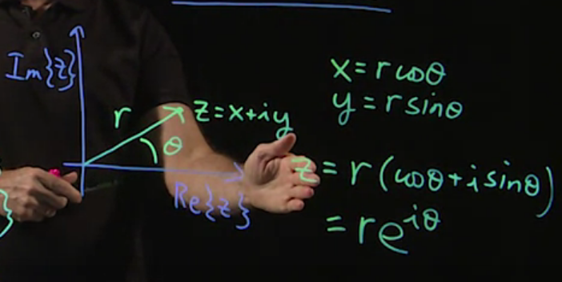
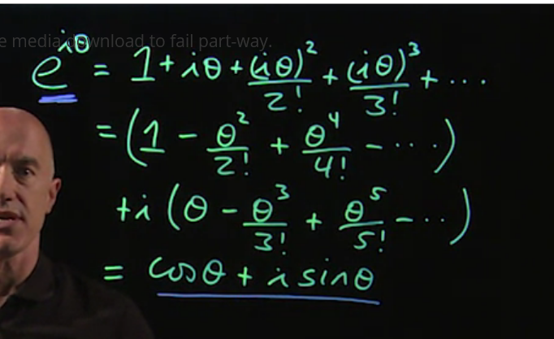

- $$i = \sqrt{-1}$$
- $$z = x + i y$$
	- Complex Conjugate
	  collapsed:: true
	  id:: 62a9ef83-666a-416b-a8f7-b7cceac63a41
		- $$\bar{z} = x - i y$$
		- $$
		  \begin{align}
		  z \bar{z} &= x^2 - (iy)^2 \\
		  &= x^2 + y^2
		  \end{align}
		  $$
	- Real Part
		- $$Re\{z\} = x = \frac{z + \bar{z}}{2}$$
	- Imaginary Part
		- $$Im\{z\} = y = \frac{z - \bar{z}}{2i}$$
	- Divide a complex number
		- $$\frac{z}{w} = \frac{z \bar{z}}{w \bar{w}}$$
	- If $z = w$, that:
		- $$Re\{z\} = Re\{z\}, Im\{z\} = Im\{w\}$$
	- $z =x + iy = r e^{i \theta}$
		- {:height 350, :width 589}
-
- $e^{i\theta} + 1 = 0$
	- Through Taylor Series:
		- $$e^{i \theta} = 1 + i \theta + \frac{(i \theta)^2}{2!} + \frac{(i \theta)^3}{3!} + \dots$$
		- Split the real part and the imaginary part:
		- $$
		  \begin{align}
		   e^{i \theta} = 
		  \end{align}
		  $$
		- 
		- We can also use this to get 欧拉公式