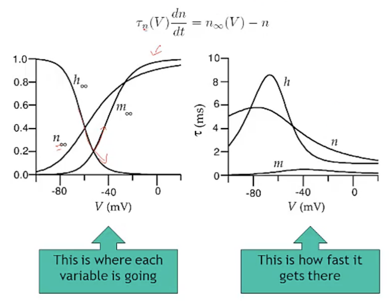
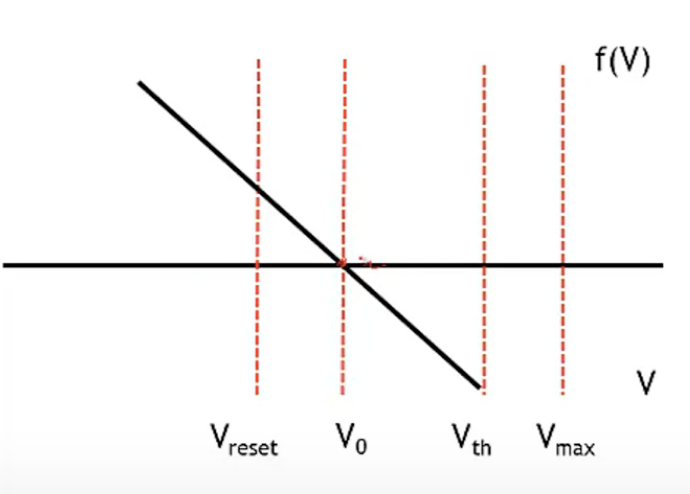

- 1. Voltage
  2. See the card
  3. hyperporlarize, decreasing
  4. z * u^5
  5. m
  6. K+ current also helps to depolarize the membrane, allowing the membrane voltage to reach higher values.
  7. True [To Find]
  8. 1
  9. $w = \frac{bV}{c}$
  10. D *
  11. 1000
  12. More slowly
  13. More quickly
  14. Same rate
  15. $V(t) = IR(1-e^{-\frac{t}{\tau}})$
  16. 250
  17. 170
- # Neural Electrics
	- The resistor, capacitor, and battery are roughly analogous to the {{cloze ion channels}} , {{cloze lipid bilayer(脂双层)}} , and {{cloze  ion gradient}} , respectively. #card
	- ## Battery:
		- {:height 196, :width 257}
		- Exchange sodium for potassium
	- ## Ion Channels
		- Some are:
			- vlotage dependent
			- transmitter dependent (synaptic)
			- $Ca$ dependent
			- mechanosenstive
			- heat senstive
		- Different ion channels have associated _conductances_
		- A given conductance tends to move the membrane potential toward the equilibrium potential for that ion
			- $E_{Na}$ ~ 50 mV (Sodium)
			  $E{Ca}$ ~ 150 mV
			  $E_K$ ~ -80 mV (Patossium)
			  $E_{Cl}$ ~ -60 mV
		- A current tends to **depolarize** the membrance, that is to move it to more positive potentials. 
		  A current tends to **hyperpolarize** the membrance, that is to move it to more negative potentials.
		- ### Conductance
			- Each ion channel has its own **conductance**.
				- {:height 153, :width 398}
				- So that the current for each branch is , by Ohim's Law, $V = IR$. Let's use conductance and we have to _discount_ the menbrance voltage drop.
					- id:: 622623b2-3ae2-45cf-8ce8-491fa306e1cf
					  $$I_i = g_i (V - E_i)$$
						- $E_i$ Equilibrium Potential
						- $g_i$ conductance
	- ## Activation Variables
		- ### Potassium Channel
			- {:height 303, :width 498}
			- The open probability increases when depolarized
			- Gating contorls whether flow in, Gate consists of 4 subunits
			- The open probability of channel is the product of the open probability of the 4 sub units. The current will flow when _all_ 4 subunits open.
				- $$P_K  =  n^4$$
				- The assumption here is that the probability of each subunit being in the open configuration is **independent** of the other subunits' configuration
			- There is a **rate** of transition between states (open or close for a subunit  ) , which is voltage dependent.
				- $$\frac{dn}{dt} = \alpha_n(V)(1 - n) - \beta_n(V)n$$
					- $\alpha_n(V)$: Close => Open
					- $\beta_b(V)$: Open => CLose
					- Left: How much is added to the open state
					- Right: How much is lost
					- Rewrite as $\tau$:
						- id:: 62275ff3-5a3a-4b7c-845f-b04b4e1caffc
						  $$\tau_n(V) \frac{dn}{dt} = n_\infty(V) - n$$
					- Where:
						- id:: 62276026-46dd-4046-a2ed-d06cc10cc14b
						  $$\tau_n(V) = \frac{1}{\alpha_n + \beta_n(V)}$$
						- $$n_\infty(V) = \frac{\alpha_n(V)}{\alpha_n(V) + \beta_n(V)}$$
			- Subunits & denpendence
		- ### Sodium Channel
			- $m$:
				- activation variable
				- 3 Subunits,
				- probability for a subunit to be open.
			- $h$ :
				- inactivation variable
				- Gating mechanism (ball in the socket mechanism), block channel when open.
				- The probability of the gate is **_not_** in place.
			- Dynamics:
				- Vlotage increases, $m$ (the degree of activation) also decreases $h$ (the level of de-inactivation).
				- There is kind of vlotage window  in which sodium is able to flow.
				- Generally this results in sodium currents being transient or self-limiting. As soon as sodium starts to flow.
					- Becasue the $m$ gates are open, the vlotage moves towards the sodium equilibrium potemtial, and that increases $V$ and in-activates $h$, thus cloing the channel again.
		- What do we do with these **activation** and **inactivation** variables?
			- We want to combine them to give us these _voltage dependent conductance's_ for the channels
				- $$g_K(V) = \bar{g_k} n^4$$
				- $$g_{Na}(V) = \bar{g_{Na}} m^3 h$$
					- $\bar{g}$ total conductances of the channel
		- ### Dynamics of activation and inactivation
			- Look at the $\tau$ form:
				- ((62275ff3-5a3a-4b7c-845f-b04b4e1caffc))
			- $n$ governs the opening of potassium channel
			- both $m$ and $h$ must be large for thesodium channel to open
			- {:height 336, :width 417}
				- the potassium channel will have a higher probability of opening for
				  larger voltage.
				- The sodium channel first has an increase of probability of opening with increasing voltage, because the increase in m with voltage. But then because h is going down to 0, as, voltage increases the, the sodium channel will close.
				- Time constant **governs how quickly** n will approach its final steady state.
				- The graphs how fast to reach steady state for that voltage.
			- {:height 361, :width 537}
				- Na+ current depolarizes the cell and is the principal driver for the upward portion of a spike.  Both mmm and hhh must be high for there to be a lot of Na+ current.  K+ current also helps to depolarize the membrane, allowing the membrane voltage to reach higher values.
	- ## Spikes
		- When we talk about "spikes", we are referring to the change in some property of the neuron over time. When we typically plot a spike, the x-axis represents **time**. What does the y-axis represent? #card
			- Voltage
- # Hodgin-Huxley Model
  id:: 6224b863-b62d-4e9f-b89d-2f1758a8b41e
	- 
		- Adding additional conductance (surrounded by redlines) to model the opening and closing of sodium and potassium channels.
		  id:: 6231ee92-cd8a-4a97-b4a2-f895e4aaa768
	- The Equation
		- $$-C_m \frac{dV}{dt} = g_L (V - E_L) + \bar{g}_K n ^4 (V - E_K) +   \bar{g}_{Na} m^3h (V - E_{Na})  - I_e$$
		- $$\frac{dn}{dt} = \alpha_n(V)(1 - n) - \beta_n(V)n$$
		- $$\frac{dm}{dt} = \alpha_m(V)(1 - m) - \beta_m(V)m$$
		- $$\frac{dh}{dt} = \alpha_h(V)(1 - h) - \beta_h(V)h$$
		-
		- $V$ -  The membrane voltage
		- $n$ - The activation variable of the potassium channels
		- $m$ - The activation variable of the sodium channels
		- $h$ - The iinactivation variable, the sodium channel
	- By  ((62245ada-f3a3-42b3-9186-b88548f58ad8)):
	  id:: 622614d8-396b-40d2-9801-2b6a0512f1ef
		- $I_R =  \frac{V}{R}$  by ((62245aef-47ce-4120-a2c5-c87ab6beab29))
		- $I_C = C \frac{dV}{dt}$
		- We get the equation
			- $$ C \frac{dV}{dt} = -\frac{V}{R} + I_{ext}$$
				- The equation is linear, and it's first order in V.
			- {:height 124, :width 158}
				- The part of the voltage dropped that occurs across the resistor is $V - V_{rest}$
			- So the equation turns to
				- $$ C \frac{dV}{dt} = -\frac{V - V_{rest}}{R} + I_{ext}$$
			- Rearrange the equation:
				- $$ \tau \frac{dV}{dt} = -V + V_{\infty}$$
					- $\tau = RC$
					- The meaning of $\infty$:
	- Pull together:
		- By  [Kirchoff's law]((622614d8-396b-40d2-9801-2b6a0512f1ef)) and ((622623b2-3ae2-45cf-8ce8-491fa306e1cf))
		- {:height 239, :width 307}
		- {:height 144, :width 363}
		  id:: 6224bb76-6534-4f53-b4c3-459a8eedb8c9
- # Dynamics of Neurons
	- ## Basic Model
		- An equation for $V$ that does sth like what a neuron does.
			- $$\frac{dV}{dt} = f(V) + I(t)$$
	- ## Task
		- Our task is to find a good function $f$ of $V$ that makes neuron do what we want it do.
	- As we observe, the behavior of the neuron can be quite close to linear as long as it's not near spiking.
	- How bad would it be to assume that we simply have a linear neuron. that is, an equstion such as we've found for the passive membrane.
		- $$\frac{dV}{dt} = -a(V-V_0) + I(t)$$
			- $a$ is the slope of the linear function, for a passive membrance it would be the conductance $g$ (with C = 1).
			- {:height 307, :width 371}
			- We have a fixed point makes $\frac{dv}{dt} = 0$, it's a stable fixed point. As we move around $V$, it will always drawn back to the fixed point.
	- ## How to get a neuron like this to **fire a spike**?
		- We need to add up some a **threshold**.
			- Because of some input, to be pushed to some threshold voltage, what I'm going to do is, set this equal to the time of a spike and jump up to a maximum, like the plot:
			  {:height 245, :width 302}
			  $$V_0 => V_{th} => V_{max}=> V_{reset}$$
			  {:height 204, :width 247}
		- Like a passive membrane:
			- ((6224bb76-6534-4f53-b4c3-459a8eedb8c9))
			- but with the aditional rule that
				- when $V \rightarrow V_{th}$, a spike is fired
				- and $V \rightarrow V{rest}$
			- $E_L$ is the resting potential of the "cell", $V_0$
	- ## How to make it **excitable** ?
		- Give $f(V)$ a range where the voltage can increase.
			- 
		- And we can get another ((6224c16a-48ac-451a-9766-09930b7fbf34)), and it is unstable.
			- Left of the point, the $\frac{dv}{dt}$ (also the _lope_)is negative
			- RIght of the point, the lope is positive
		- So we need a $V_{max}$ to stop inceasing vlotage, and reset to $V_{rest}$
			- $f(V)$ Examples:
				- Quadratic function
				- Exponential Function
					- $$f(V) = -a(V - V_0) + exp([V-V_{th}) / \Delta])$$
						- Fourcaud-Trocme et al.
						- $\Delta$ : parameter, increases non-linearity
	- # Theta neuron
		- {:height 295, :width 338}
			- Ermentrout and Kopell
		- In the the $\theta$ neuron, the voltage is thought of as a phase, $\theta$
		- When phase reaches $\pi$, we call it a spike
		- Why phase not countinous variable ?
			- When you pass $\pi$, the voltage is reset automatically
		- Equivalent to the one dimensional voltage with a quardratic nonlinearity.
		- Fixed Points:
			- $V_{rest}$
			- $V_{th}$, non-stable point
		- This model fires regularly, even without input.
	- # 2D Model
		- preventing the spike from increasing to infinity, apart putting some maximum on it. Let's try falling.
		- 
		- It has another stable point
		- The system is called Bi-stable
		-
		- In order to allow the dynamics to **come back** from that stable fixed point.
			- In ((6224b863-b62d-4e9f-b89d-2f1758a8b41e)) we have 2 seperate mechanism help restore voltage back to $V_{rest}$
				- 1. One was that the sodium, switching of the drive toward the sodium equilibrium potential.
				  2. The other was set that potassium activated pulling the voltage back to what the potassium equilibrium potential
				-
			- We introduce 2nd variable $u$ to contol inactivaton.
				- $$ dV / dt = f(V) + I(t)  $$
				- $\rightarrow$  
				   $$dV/dt = F(V) + G(u) + I(t) \\  du/dt = -u + H(V)$$
	- # Simple Model
		- {:height 291, :width 420}