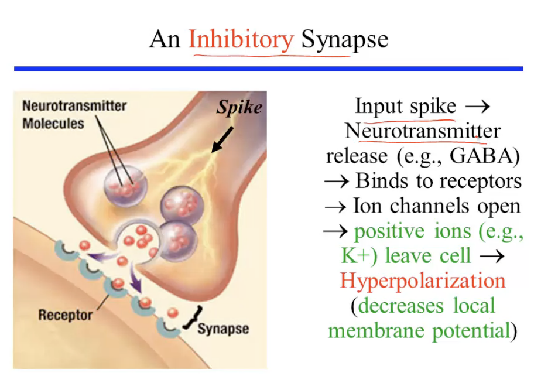

- How do neurons connect to form networks #card
	- They use synapses!
- The mechannism of Synapse in TODO: laste section
	- The Excitatory Synapse
		- {:height 347, :width 492}
	- The Inhibitory Synapse
		- 
- We want a _computational_ model of the effects of a**synapse** on the membrane potential V.
	- 
	- # Model
	- We would like to model the effects of input spike as they are transimitted by the synapse on the membrane potential V of a neuron.
		- Use  [**RC Circuit Model of the Membrance**] in [[Computing in Carbon]] to model membrane potential.
			- $$\tau_m \frac{dV}{dt} = -(V - E_L) + I_e R_m$$
				- This equation describes  how the membrane behaves as a function of time as you inject some input current into the cell
					- {:height 178, :width 311}
						- $V_{SS} = E_L + I_e R_m$ steady state
					- 
						- If you stop the currnet input, the changes are as above
					- $\tau$ plays an important role in determining how quickly the cell reacts to changes og input.
						- If $\tau$ is very large, it takes a long time to converge to the steady state, and long time to converge back to the equilibrium potential when input is off.
						- You can get contary.
		-
	-
	- How do we model the effects of a synapse on the membrane potential V?
		- Given that we have a model of the membrane potential, how do we model the  opening and closing if ionic channels?
			- Refer to ((6224b863-b62d-4e9f-b89d-2f1758a8b41e)) that ((6231ee92-cd8a-4a97-b4a2-f895e4aaa768)).
			- 
				- We can do sth similar for synapses, which in effect also open and close certain channels.
				- $$\tau_m \frac{dV}{dt} = -((V-E_L) + g_s(V - E_s)r_m) + I_eR_m$$
					- $g_s$
						- We can model the effects of a synapse on the membrane potential by using a synaptic conductance. And that is given by $g_s$
						- conductance which is going to change as a functino of the inputs being received by the synapse
							- $g_s = g_{s,max}P_{rel}P_{s}$
							  id:: 62395f27-38e0-4dfa-806f-16dff266308d
								- $g_{s, max}$ the maximum conductance associated with that particular synapse.
									- And that for example is associated with the number of channels that one might  find on the post synaptic neuron.
									- So the more the number of channels, the larger the value for $g_{s, max}$
								- $P_{rel}$ the probability that neurotransmitters are going to be released into the synaptic cleft.
								- $P_S$ probability of post synaptic channel opening (= fraction of channels openned)
					- $E_S$ the reversal potential or the equilibrium potential of the synapse
					- $g_s(V - E_s)r_m)$ input coming in from the synapse.
						- $(V - E_s)$difference between the current voltage and the equilibrium potential of the synapse
					- $I_eR_m$ input current
		- ### Basic Synaptic Model
			- ((62395f27-38e0-4dfa-806f-16dff266308d))
				- Assume $P_{rel} = 1$
				- Model the effect of a single spike input on $P_s$
				- Kinetic Model of postsynaptic channels
-
-