- {{renderer :tocgen, [[]], 6, h}}
- {{query (and (todo todo doing) (page <% current page %>))}}
- A DIFFERENTIAL EQUATION is a relation between a function and its derivatives.
- The study of differential equations has three parts:
  collapsed:: true
	- Analytic, exact, symbolic methods
	- Quantitative methods (direction fields, isoclines ....)
	- Numerical methods
- # Classification
  collapsed:: true
	- 1. 1st-Order & 2nd-Order
	  2. ODE & PDE
	  3. Linear & Non-Linear
		- Linearity
			- For any part in the equation $F\frac{d^n y }{dx^n}$, there is never a $y^2$, or a function of $y$ that has terms in the Taylor Series that are above $y$
			- https://math.stackexchange.com/questions/414597/linear-vs-nonlinear-differential-equation
			- [[Questions]]
- # Concepts
	- Fix Point or Equilibrium Point
		- Stable & Unstable
- # Solve Equation
  collapsed:: true
	- ## How to slove DE
	  collapsed:: true
		- To specify a particular solution of an ODE you have to give an INITIAL CONDITION: when x takes on a certain value, y takes on a specified value.
		- Unfortunately, most real life equations aren't explicitly **solvable**, and often you don't actually care as much about the explicit solution as about the general properties.
	- ## Theories & Methods
		- ### The Principle of Superposition for 2nd-Order Linear ODE
		  id:: 62a95165-c532-49eb-8038-5ec42c0b043b
		  collapsed:: true
			- We have:
				- id:: 62a882f4-f14d-4474-a856-a6deb25f17ea
				  $$
				  \ddot{x} + p(t) \dot{x} + q(t)x = 0
				  $$
				- We'll consider what's called homogeneous equation, where the right-hand side in this equation is 0.
			- The _Principle of Superposition_ supposes that we if we have 2 solutions: $x=X_1(t), x= X_2(t)$
			  id:: 62aeb7fd-6e07-40fa-983a-4b16f6a47146
			- Then $X = C_1 X_1(t) + C_2 X_2(t)$ is also a solution ($C_1$ and $C_2$ are constants)
			  collapsed:: true
				- Proof
					- 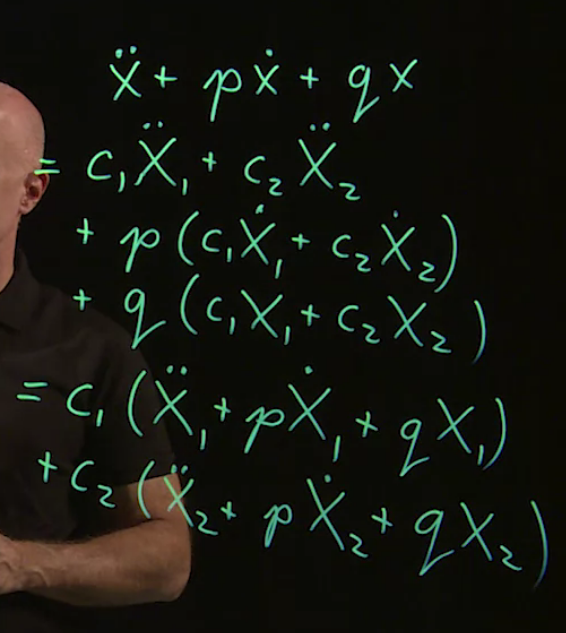
		- ###  The Wronskian Determinent
		  id:: 62a889b7-394a-44f5-b5b9-ec73d65836ab
		  collapsed:: true
			- We have $X = C_1 X_1(t) + C_2 X_2(t)$ for ((62a882f4-f14d-4474-a856-a6deb25f17ea)) and initial value $x(t_0) = x_0, \dot{x}(t_0) = u_0$
			-
			- For solution $X$, it has to saitisfy:
				- $$
				  \begin{align}
				  C_1 X_1(t_0) + C_2X_2(t_0) = X_0 \\
				  C_1 \dot{X_1}(t_0) + C_2 \dot{X_2}(t_0) = U_0 \\
				  \end{align}
				  $$
			- write it into the matrix form:
				- $$
				  \begin{bmatrix}
				  X_1(t_0) & X_2(t_0) \\
				  \dot{X_1}(t_0) & \dot{X_2}(t_0) \\
				  \end{bmatrix}
				  
				  \begin{bmatrix}
				  C_1 \\
				  C_2
				  \end{bmatrix}
				  = 
				  \begin{bmatrix}
				  X_0 \\
				  U_0
				  \end{bmatrix}
				  $$
			- The determinant of matrix:
				- $$
				  \begin{bmatrix}
				  X_1(t_0) & X_2(t_0) \\
				  \dot{X_1}(t_0) & \dot{X_2}(t_0) \\
				  \end{bmatrix}
				  $$
				- TODO Connect this with the knowledge in [[Linear Algebra]]
			- is called _Wronskian_
			- When ((62a889b7-394a-44f5-b5b9-ec73d65836ab)) is not 0, there is an **unique** solution
		- ### Laplace Transform
		  id:: 62aeb7fd-49f3-4d0e-8414-836907c7d008
		  collapsed:: true
			- the Laplace transform of some function of time, $f(t)$, will become another function,
			  which is a function of a different variable s, $F(s)$.
			- the Laplace transform is transforming a function in $t$ space to another function in $s$ space
			- collapsed:: true
			  $$\mathcal{L}\{f(t)\} = F(s) = \int_0^{\infty} e^{-st} f(t) dt$$
				- Example:
					- 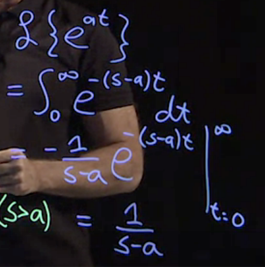{:height 253, :width 253}
					- $\mathcal{L} \{ \sin{bt}\}$
						- 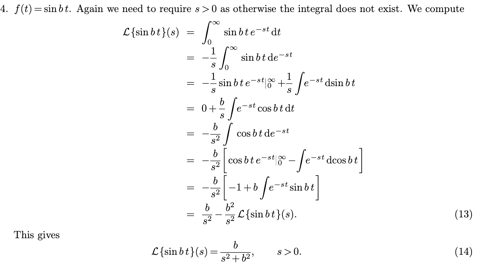
							- http://www.math.ualberta.ca/~xinweiyu/334.1.11f/334.1.11.lec22.pdf
			- Properties:
			  collapsed:: true
				- Linearity:
					- $$\mathcal{L}\{c_1 f_1(t) + c_2 f_2(t)\} = c_1 \mathcal{L}\{ f_1(t)\} + c_2 \mathcal{L}\{ f_2(t) \}$$
					-
				- Invertable:
					- $$\mathcal{L}^{-1} \{ F(s)\} = f(t)$$
			- Table:
			- For Differential Equation:
				- 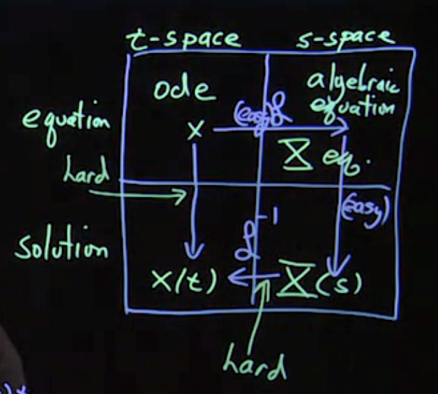{:height 340, :width 364}
				- 1. Take Laplace Transform against ODE $x$, there will a simple linear algebraic equation which is easy to solve.
				  2. Get the solution of Laplace-transformed equation $X(s)$
				  3. Use the inverse Laplace transform to get solution $x(t)$ (Look the table)
				-
		- ### Cover-up Method
		  id:: 62b14872-2283-43bc-924c-8819dfabf1fb
			- https://math.mit.edu/~jorloff/suppnotes/suppnotes03/h.pdf
		- ### Heavyside Step Function
		  id:: 62b00425-4a1f-4ed2-a963-d483bb57e034
		  collapsed:: true
			- Typical Discontinuous Function
			- 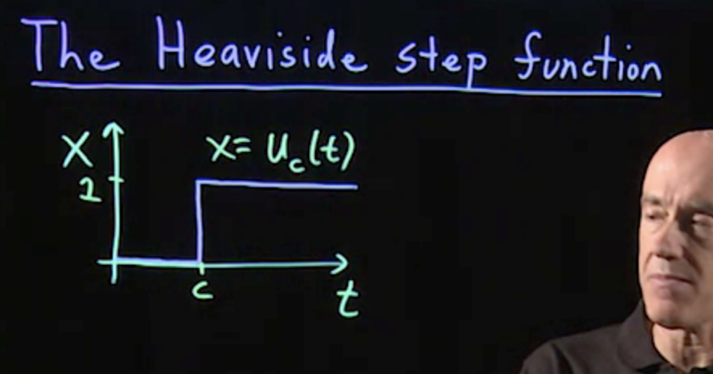{:height 158, :width 316}
			- 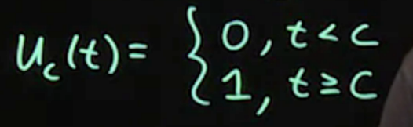{:height 139, :width 335}
			- Laplace Transform
			  collapsed:: true
				- 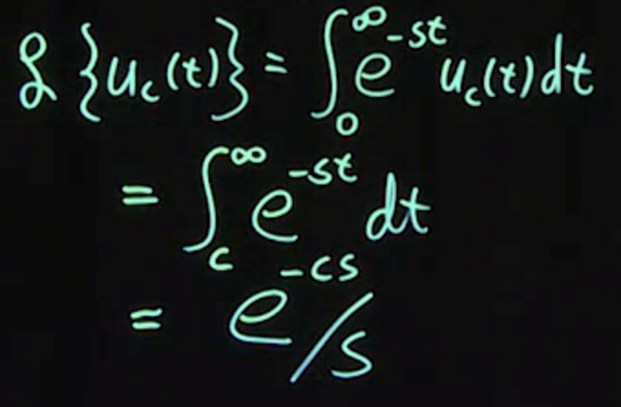{:height 335, :width 506}
			- Usage:
			  collapsed:: true
				- simulate a step-down function
					- 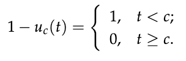
				- simulate a step-up, step-down function
					- 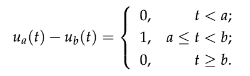{:height 102, :width 318}
				- Shift a function to distance C 平移
					- 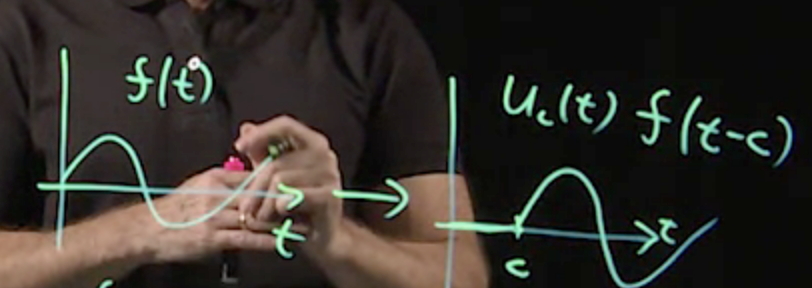{:height 174, :width 442}
					- Laplace Transform:
						- 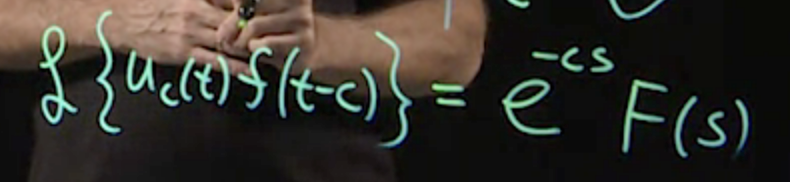{:height 100, :width 426}
						- Proof:
							- 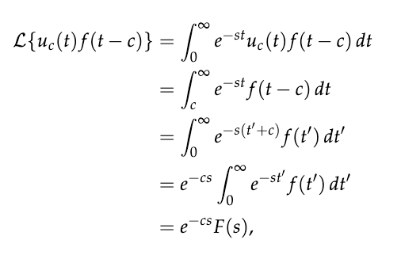{:height 221, :width 359}
				- Model a discontinuity in the inhomogeneous term of the equation.
					- 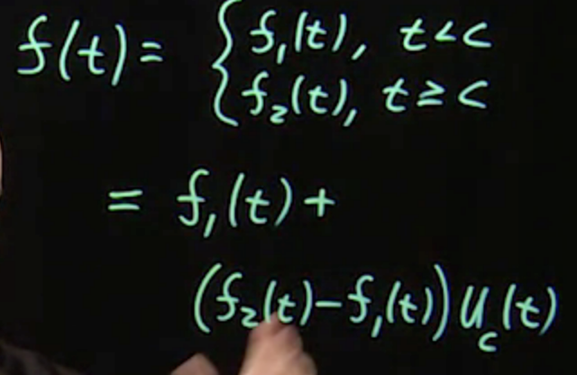
					- When $t < 0$, the right part is 0
					- When $t > 0$, the right part remains.
		- ### Dirac Delta Function
		  id:: 62b03149-3161-4463-ad78-04ed2381d8ad
		  collapsed:: true
			- Useful for modeling an impulse force
			- The area of the delta function should be 1
				- 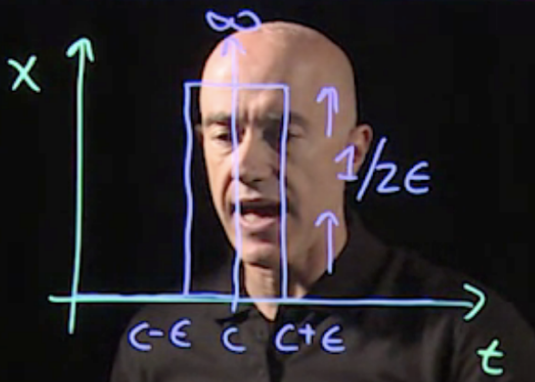{:height 259, :width 362}
			- Use ((62b00425-4a1f-4ed2-a963-d483bb57e034)) to model
				- $$ \delta(t-c) = \lim_{\epsilon \to 0} \frac{1}{2\epsilon} (u_{c - \epsilon}(t) - u_{c+ \epsilon (t)})$$
					- Also called a distribution, rather than a function
			- Integrate some function $f(t)$
				- for $c > 0$
				- $$\int_0^{\infty} f(t) \delta(t-c) dt = f(c ) \int_0^{\infty} \delta(t-c) dt  = f(c)$$
			- Laplace Transform:
				- $$\mathcal{L}\{\delta(t-c)\} = \int_0^{\infty} e^{-st} \delta(t-c) dt = e^{-cs} $$
				-
		- ### Fourier Series
		  collapsed:: true
			- a way representing a function
			- #### General Form:
				- for periodic function $f(x)$ with period $2L$
				  $$
				  f(x) = \frac{a_0}{2} + \sum_{n = 1}^ {\infty} a_n \cos{\frac{n \pi x}{L}} + b_n \sin{\frac{n \pi x}{L}}
				  $$
			- #### Orthogonality Relations
				- We use ***orthogonality relations*** to determine $a_0$, $a_n$, and $b_n$
					- collapsed:: true
					  $$
					  \int_{-L}^{L} cos{\frac{n \pi x}{L}} cos{\frac{m \pi x}{L}} dx = L \delta_{n m }
					  $$
						- You only get $L$ when $n$ and $m$ are equal, other wise you get 0. We $\delta_{nm}$ , so called **Kronecker delta**, to represent this.
							- $$
							  \delta_{nm} = \left\{ 
							  \begin{array}{ll}
							  0, n \neq m\\
							  1, n = q
							  \end{array}
							  \right.
							  $$
					- $$
					  \int_{-L}^{L} sin{\frac{n \pi x}{L}} sin{\frac{m \pi x}{L}} dx = L \delta_{n m }
					  $$
					- $$
					  \int_{-L}^{L} cos{\frac{n \pi x}{L}} sin{\frac{m \pi x}{L}} dx = 0
					  $$
				- determine $b_n$
					- $$b_n = \frac{1}{L} \int_{-L}^{L} f(x) \sin{\frac{n \pi x}{L} dx}$$
					- As:
						- $$
						  \begin{align*}
						  &\int_{-L}^{L} f(x) \sin{\frac{n \pi x}{L} dx} \\
						  &= \sum_{m = 1}^{\infty} b_m  \int_{-L}^{L} sin{\frac{n \pi x}{L}} sin{\frac{m \pi x}{L}} dx \\
						  &= \sum_{m = 1}^{\infty}  b_m L \delta_{nm} = L b_n
						  \end{align*}
						  $$
						- Plus, according to orthogonal relations
						  $$
						  \int_{-L}^{L} cos{\frac{n \pi x}{L}} sin{\frac{m \pi x}{L}} dx = 0
						  $$
				- determine $a_n$
					- $$a_n = \frac{1}{L} \int_{-L}^{L} f(x) \cos{\frac{n \pi x}{L} dx}$$
			- Fourier Cosine Series
			  id:: 62b4881a-b332-4728-9757-7a2b5979c617
				- $$
				  f(x) = \frac{a_0}{2} + \sum_{n = 1}^ {\infty} a_n \cos{\frac{n \pi x}{L}} \\
				  a_n = \frac{2}{L} \int_{0}^{L} f(x) \cos{\frac{n \pi x}{L} dx}
				  $$
				- When $f(x)$ is even function ($f(-x) = f(x)$), because $\sin{\frac{n \pi x}{L}}$ is odd function, so:
				  $$b_n = \frac{1}{L} \int_{-L}^{L} f(x) \sin{\frac{n \pi x}{L} dx} = 0$$
				- Because $f(x)$ is even, so:
				  $$a_n = \frac{1}{L} \int_{-L}^{L} f(x) \cos{\frac{n \pi x}{L} dx} = \frac{2}{L} \int_{0}^{L} f(x) \cos{\frac{n \pi x}{L} dx}$$
				-
			- Fourier Since Series
				- $f(x)$ is odd function, $f(x) = -f(x)$
				  $$
				  f(x) =  \sum_{n = 1}^{\infty}  b_n \sin{\frac{n \pi x}{L}} \\
				  b_n = \frac{2}{L} \int_{0}^{L} f(x) \sin{\frac{n \pi x}{L} dx}
				  $$
			- Example:
				- Represent the function in Fourier Series
				  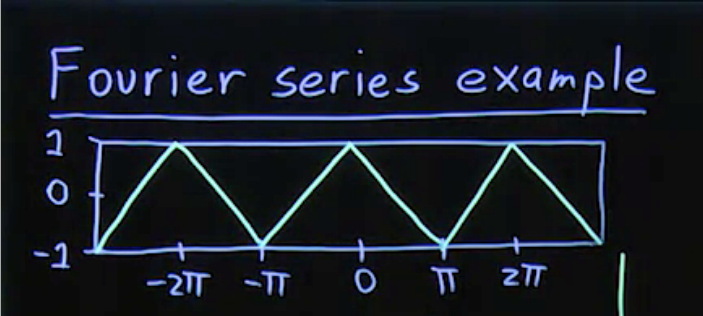{:height 232, :width 355}
					- $f(x) = 1 - \frac{2x}{\pi}, 0 \leqslant x  \leqslant \pi$ is an even function, and $L = \pi$
					- According to ((62b4881a-b332-4728-9757-7a2b5979c617))
					  $$
					  \begin{align*}
					  f(x) &= \frac{a_0}{2} + \sum_{n = 1}^\infty a_n \cos{nx}
					  \end{align*}
					  $$
					- Get $a_n$
					  $$
					  a_n = \frac{2}{\pi} \int_0^{\pi} f(x) \cos{n x} dx
					  $$
						- $a_0 = 0$, by computing the integral
						- $n \neq 0$
							- $$
							  \begin{align*}
							  a_n &= \frac{2}{\pi} \int_0^{\pi} (1 - \frac{2x}{\pi}) \cos{n x} dx \\ 
							  &=  \frac{2}{\pi} \int_0^{\pi} \cos{n x} - \frac{2x}{\pi} \cos{n x} dx
							  \end{align*}
							  $$
								- The integral of $\cos{n x}$ term is 0
								- The integral of $\frac{2x}{\pi} \cos{n x}$ term can be done by  [integration by parts](((62af2cf4-b493-4e74-b2cd-927f4e2f4669)))
							- $$
							  \begin{align*}
							  a_n &= \frac{4}{n^2 \pi^2}  (1 - \cos{n \pi}) \\ 
							  &= 
							  \begin{cases}
							  \frac{8}{n^2 \pi^2}, n = 1, 3, 5, \dots \\
							  0, n = 2, 4, 6, \dots
							  \end{cases}
							  \end{align*}
							  $$
					- Result
						- $$
						  f(x) = \frac{8}{\pi^2} (\cos{x} + \frac{\cos{3x}}{3^2} + \frac{\cos{5x}}{5^2} + \dots)
						  $$
			-
	- ## ODE
	  collapsed:: true
		- ## Separable Equation
		  collapsed:: true
			- We have a equation and **initial value**:
				- $$g(y)\frac{dy}{dx} = f(x),  y(x_0) = y_0$$
			- We say this equation is _**separable**_, which can be integrated.
			- 推导1：
				- $$
				  \int_{x_0}^x g(y(x)) y'(x) dx = \int_{x_0}^x f(x) dx
				  $$
				- let $u = y(x)$, $du = y'(x)dx$
				- $$
				  \int_{y_0}^y g(u) du = \int_{x_0}^x f(x) dx
				  $$
			- 推倒2：
				- Use lebniz's notation:
				- $$
				  \int g(y) dy = \int f(x) dx
				  $$
		- ## 1st-Order ODE
		  collapsed:: true
			- ## First-Order ODE
			  collapsed:: true
				- $$
				  y^{'} = f(x, y)
				  $$
					- Some ODE:
						- $y^{'}= ky$. Gerneral Solution: $y = C e^{kx}$, $C$ is constant
				- Direction fields
				- INTEGRAL CURVE
				- ISOCLINE
					- To draw the direction field, find where F(x,y) is constant, say m .This is an ISOCLINE. Eg
			- ## Linear First-Order Equation
			  collapsed:: true
				- $$
				  \frac{dy}{dx} + p(x)y = g(x), y(x_0) = x_0
				  $$
				- Some first-order linear ODEs are separable but the general one is not.
				- ### How to solve:
				  collapsed:: true
					- Multiply a integrating factor $\mu(x)$
					  collapsed:: true
						- $$
						  \mu(x)[\frac{dy}{dx} + p(x)y] = \mu(x)[g(x)]
						  $$
					- We need to find the correct $\mu(x)$ to make the left hand side become:
					  collapsed:: true
						- id:: 62a6a1ec-c2f2-40ec-8dc4-ce95146a6eb9
						  $$
						  \begin{align}
						  &\mu(x)[\frac{dy}{dx} + p(x)y] = \newline
						  &\frac{d}{dx} [\mu(x)y(x)]
						  \end{align}
						  \tag{1}
						  $$
						- Then we can make integral
					- To get the integrating factor,
					  collapsed:: true
						- We have $eq(1)$ in the right-hand side using the _product rule_ for derivtive:
							- $$
							  \frac{d}{dx} [\mu(x)y(x)] = \mu \frac{dy}{dx} + y \frac{d\mu}{dx}
							  \tag{2}
							  $$
						- Put $eq(2)$ back to $eq(1)$:
							- $$
							  \mu \frac{dy}{dx} + \mu p y= \mu \frac{dy}{dx} + y \frac{d\mu}{dx} \\
							  $$
							- cancel $\mu \frac{dy}{dx}$
								- $$
								  \cancel{\mu \frac{dy}{dx}} + \mu p y= \cancel{\mu \frac{dy}{dx}} + y \frac{d\mu}{dx} \\
								  $$
							- We have:
								- $$
								  \mu p y = y \frac{d\mu}{dx}
								  $$
							- cacel $y$
								- $$
								  \mu p \cancel{y} = \cancel{y} \frac{d\mu}{dx}
								  $$
							- We have:
								- $$
								  \frac{d{\mu}}{dx} = \mu p(x) 
								  \tag{3}
								  $$
					- We get $\mu(x)$ by sloving $eq(3)$
						- $$
						  \mu(x) = e^{\int_{x_0}^xp dx}
						  \tag{4}
						  $$
					- as $g = \frac{dy}{dx} + p(x)y$, we have $eq(1)$ as:
					  collapsed:: true
						- $$
						  \frac{d}{dx} [\mu y] = \mu g
						  \tag{5}
						  $$
						- Integral this equation:
							- $$
							  \mu y \rvert_{x_0}^x = \int_{x_0}^{x} \mu(x) g(x) dx
							  $$
							- according to $eq(4)$
								- $$
								  \begin{aligned}
								  \mu(x_0) & = e^{\int_{x_0}^{x_0}p dx} \\
								  & = 1
								  \end{aligned}
								  $$
							- We have:
								- $$
								  \mu(x)y - y_0 =  \int_{x_0}^{x} \mu(x) g(x) dx
								  $$
					- At last, we have the analytical solution to the linear first-order equation:
						- $$
						  y(x) = \frac{1}{\mu(x)} \biggl(y_0 + \int_{x_0}^{x} \mu(x) g(x) dx \biggl)
						  $$
		- ## 2nd-Order ODE
		  collapsed:: true
			- ## Homogeneous 2nd-Order ODE with Constant Coefficients
			  id:: 62aeb7fd-6c21-4b25-96f7-894a8b7a091c
			  collapsed:: true
				- General Equation:
					- $$
					  a\ddot{x} + b\dot{x} + cx = 0
					  $$
					- Homogeneous means the right side equals 0
						- TODO Specify what is homoheneous
					- ### Characteristic Equation
					  id:: 62aeb7fd-7cf4-4f71-aeba-48e863305119
						- Use an ((62a9cf47-d828-41e8-b20c-1843ebbf14f4))
						  id:: 62a95165-6d47-47b1-bbfb-d427a028425a
							- Try $x(t) = e^{rt}$
							- We have:
								- $$
								  a r^2 e^{rt} + b r e^{rt} + c e^{rt} = 0
								  $$
							- cancel $e^{rt}$
								- $$
								  a r^2 + b r + c = 0
								  $$
								- We get the **characteristic equation**
						- characteristic equation has roots:
							- $$
							  r = \frac{-b \pm \sqrt{b^2 - 4ac}}{2a}
							  $$
							- For $\sqrt{b^2-4ac} > 0$, the root is called ((62aaf7d2-d9c4-467a-b931-30b4e3cdbec1))
							- For $\sqrt{b^2-4ac} < 0$, the root is called ((62aaa74d-532e-4e6c-91aa-ccee1f797f73))
							- For $\sqrt{b^2-4ac} = 0$, the root is called ((62aaf7d2-b717-48a5-b6d7-77dea27a5661))
					- ### Distinct Real Roots
					  collapsed:: true
					  id:: 62aaf7d2-d9c4-467a-b931-30b4e3cdbec1
						- We can use [The Superposition Principle](((62a95165-c532-49eb-8038-5ec42c0b043b))) to have solution:
							- $$x(t) = C_1 e^{r_1 t} + C_2 e^{r_2 t}$$
							- Then we can get the values of $C_1$ and $C_2$
					- ### Complex-Conjugate Roots
					  id:: 62aaa74d-532e-4e6c-91aa-ccee1f797f73
					  collapsed:: true
						- We have a complex root $r = \lambda + i \mu$ and its conjugate $\bar{r} = \lambda - i \mu$ since $\sqrt{b^2-4ac} < 0$
						- Then we have $z = e^{\lambda t} e^{i \mu t}$ as the ansatz $z = e^{rt}$, and $\bar{z} = e^{\lambda t} e^{-i \mu t}$
						- We are looking for real solutions, then use [the super position principle](((62a95165-c532-49eb-8038-5ec42c0b043b))), we can get solutions as:
							- $$
							  \begin{align}
							  \frac{z + \bar{z}}{2} &= Re\{z\} = x_1\\
							  \frac{z - \bar{z}}{2} &= Im\{z\} = x_2
							  \end{align}
							  $$
						- Recall
							- $$e^{i\mu t} = cos\mu t + i sin \mu t$$
							- from [[Complex Number]]
						- So:
						  $$x_1(t) = e^{\lambda t} cos \mu t$$
						  $$x_2(t) = e^{\lambda t} sin \ mu t$$
						- Apply ((62a95165-c532-49eb-8038-5ec42c0b043b)) a second time to determine the general solution for $x(t)$:
							- id:: 62aac443-bfbb-417c-8b44-190bd53552fa
							  $$
							  x(t) = e^{\lambda t} (A \cos{\mu t} + B \sin{\mu t})
							  $$
							- With a initial value, we can get $A$ and $B$
					- ### Repeated Roots
					  id:: 62aaf7d2-b717-48a5-b6d7-77dea27a5661
						- the root $r$ has only one root, we are missing one solution.
						- To find the solution, we can get at it through a limiting process, starting from general solution from ((62aaa74d-532e-4e6c-91aa-ccee1f797f73))
							- ((62aac443-bfbb-417c-8b44-190bd53552fa))
						- And then to find a specific solution satisfying 2 initial conditions:
						  $$x(0) = x_0, \dot{x}(0) = u_0$$
						- We have:
						  $$A = x_0, B = \frac{u_0 - \lambda x_0} {\mu}$$
						  put it back we have the
						- Specific Solution:
						  $$
						  x(t) = e^{\lambda t} (x_0 cos{\mu t} + \frac{u_0 - \lambda x_0}{\mu} \sin{\mu t})
						  $$
						- Limit this solution as $\mu -> 0$
							- TODO 怎么想到极限的
						- 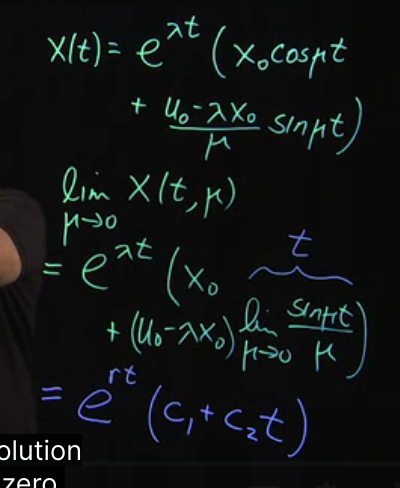{:height 319, :width 263}
							- using l'hospital rule
						- The missing function was:
							- $$e^{rt} (C_1 + C_2 t)$$
			- ## Inhomogeneous 2nd-Order ODE
			  collapsed:: true
				- General Form: 
				  collapsed:: true
				  $$\ddot{x} + p(t)\dot{x} + q(t) x = g(t)$$
					- With initial value:
					  $$x(0) = x_0, \dot{x} (0) = u_0$$
				- Solution:
					- Step [1] Solve the homogeneous equation:
						- $$x_h(t) = C_1 x_1(t) + C_2 x_2 (t)$$
					- Step [2] Find the particular solution:
					  collapsed:: true
						- TODO How to find
						- $$x_p(t) $$
					- Step [3] Write
						- $$x(t) = x_h(t) + x_p(t)$$
						- Determine $C_1$ and $C_2$ from initial conditions
					- Proof:
					  collapsed:: true
						- Substitute the $x(t)$ in and we get:
							- 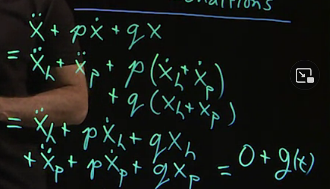{:height 343, :width 529}
						- As $\ddot{x_h} + p\dot{x_h} + q x_h = 0$
						- the equation  = g(t)
				- Particular Solutions
					- Use ((62a9cf47-d828-41e8-b20c-1843ebbf14f4))
					- Exponential Function
					  collapsed:: true
						- Try $Ae^{nt}$ for $g(t) = B e^{nt}$ as particular solution
						- Or $Ate^{nt}$
							- 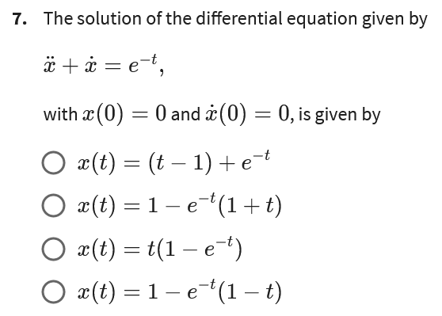{:height 267, :width 365}
								- Choose B
					- Since/Cosine
						- Try $x = A \cos{t} + B \sin{t}$
						  collapsed:: true
							- or $At \ cos{t}$
								- 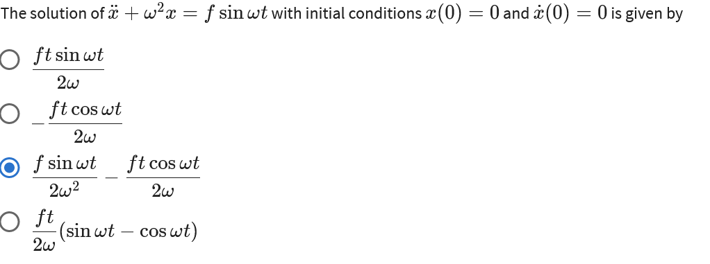
						- Convert to Complex Expression
							- TODO Explore Euler Indentit & Img & Real Part according to sin or cos
							- 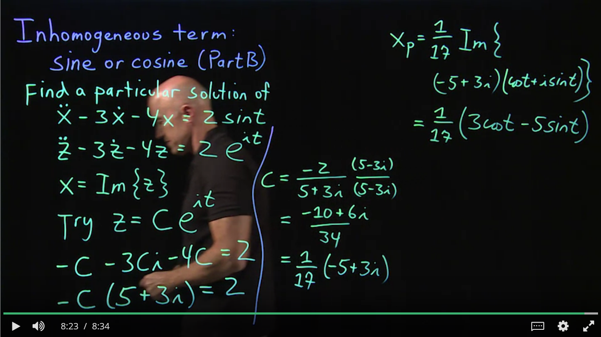
					- Polynomials
						- 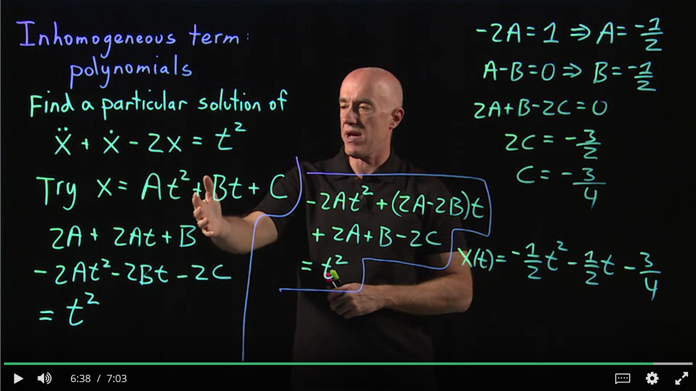
			- ## 2nd-Order ODE with Constant Coefficients by Laplace Transform
			  collapsed:: true
				- Refer to ((62aeb7fd-49f3-4d0e-8414-836907c7d008))
				- We have:
					- $$a \ddot{x} + b \dot{x} + cx = g(t)$$
				- Apply Laplace Transform:
					- 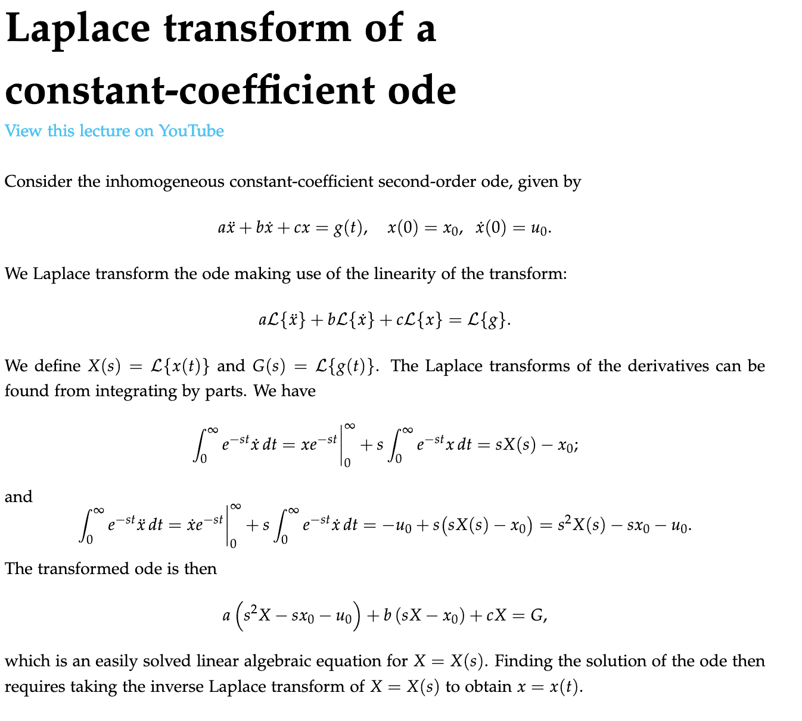
						- https://www.math.hkust.edu.hk/~machas/differential-equations-for-engineers.pdf
				- Let $u = e^{-st}, dv = \dot{x}(t)dt$,
				  Then $du = -s e^{-st} dt, v = x(t)$
				- Use ((62af2cf4-b493-4e74-b2cd-927f4e2f4669))
					- as t goes to infinity, $x e^{-st}$ goes to zero.
						- TODO what if $x < 0$
				- Use ((62b14872-2283-43bc-924c-8819dfabf1fb))
			- ## Discontinuous Inhomogeneous Term
				- 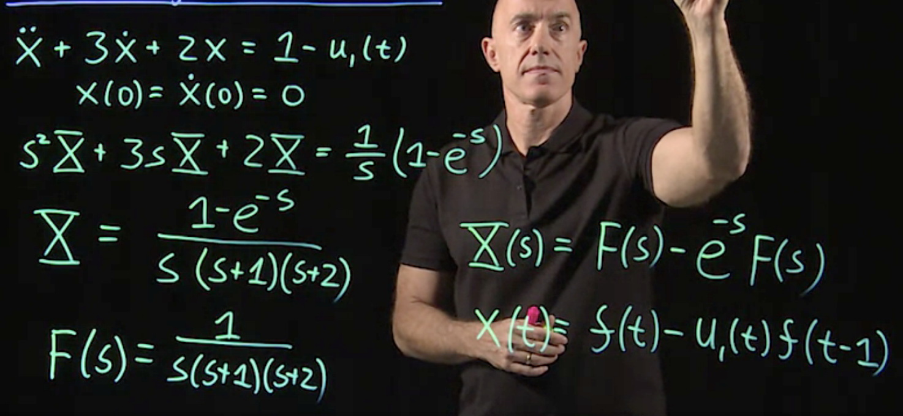
				-
			- ## Impulsive Inhomogeneous Term
		- ## Series Solution
		  collapsed:: true
			- TODO 为什么微分方程的解有级数
			- An example:
				- $$y^{''} + y = 0$$
					- Use ansatz:
						- $$y(x) = \sum_{n = 0}^{\infty} a_n x^n$$
					- Substitute it into the equation, get the derivative term by term.
						- $$
						  \sum_{n = 2}^{\infty} n(n-1)a_n x^{n-2} + 
						  \sum_{n = 0}^{\infty} a_n x^n = 0
						  $$
					- write this left-hand side as one power series.
						- $$
						  \sum_{n = 0}^{\infty}(n+2)(n+1)a_{n+2} x^{n} + 
						  \sum_{n = 0}^{\infty} a_n x^n = 0
						  $$
					- combine them to one series
						- $$
						  \sum_{n = 0}^{\infty} \Big[(n+2)(n+1)a_{n+2} + a_n \Big]x^n = 0
						  $$
					- Since the right side equals to 0, the $\Big[(n+2)(n+1)a_{n+2} + a_n \Big]$ equals to 0
						- $$
						  a_{n+2} = \frac{- a_n}{(n+2)(n+1)}
						  $$
						- So called **recursion relation**
					- $$
					  \begin{align*}
					  y(x) &= a_0 (1 - \frac{x^2}{2!} + \frac{x^4}{4!} - \frac{x^6}{6! } + \dots) \\
					  &+ a_1 (x - \frac{x^3}{3!} + \frac{x^5}{5!} - \frac{x^9}{9!} + \dots) \\
					  &= a_0 \cos{x} + a_1 \sin{x}
					  \end{align*}
					  $$
			- For ODE with non-constant coefficients
				- $$y^{'' } - xy = 0$$
				- Try $y(x) = \sum_{n=0}^{\infty} a_n x^n$
				- we get:
					- $$
					  \sum_{n = 2}^{\infty} n(n-1)a_n x^{n-2} + 
					  \sum_{n = 0}^{\infty} a_n x^{n+1} = 0
					  $$
				- write this left-hand side as one power series.  
				  $$
				  	  \sum_{n = -1}^{\infty}(n+3)(n+2)a_{n+2} x^{n+1} + 
				  	  \sum_{n = 0}^{\infty} a_n x^{n+1} = 0
				  $$
				- Isolate the first term $n = -1$
					- $$
					  2a_2 + \sum_{n = 0}^{\infty} \Big[(n+2)(n+3)a_{n+3} + a_n \Big]x^{n+1} = 0
					  $$
				- Each term as coeffeicients should be 0
					- $$a_2 = 0$$
					- $$\Big[(n+2)(n+3)a_{n+3} + a_n \Big] = 0$$
				- We get recursion relation:
					- $$a_{n+3} = \frac{a_n}{(n+3)(n+2)}$$
				- Result:
					- 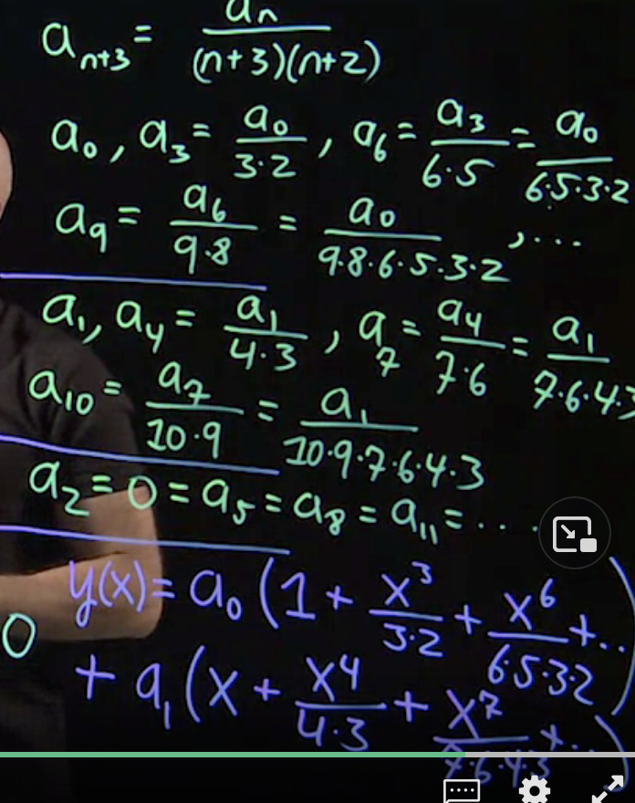
		- ## Systems of DE
			- Use [[Linear Algebra]]
			- ### Definition & Form
			  collapsed:: true
				- We have:
					- $$
					  \begin{align*}
					  \dot{x}_1 = a x_1 + b x_2 \\
					  \dot{x}_2 = c x_1 + d x_2
					  \end{align*}
					  $$
				- Write in the matrix form:
					- id:: 62b14922-bbb5-407f-8732-9b467d592263
					  $$
					  \begin{align*}
					  \frac{d}{dt} 
					  \begin{pmatrix}
					  x_1 \\
					  x_2
					  \end{pmatrix} &= 
					  \begin{pmatrix}
					  a & b \\
					  c & d
					  \end{pmatrix} 
					  \begin{pmatrix}
					  x_1 \\
					  x_2
					  \end{pmatrix}  \\
					  \mathbf{\dot{x}} &= \mathbf{A} \mathbf{x}
					  \end{align*}
					  $$
			- ### Solution
				- Try $x(t) = \mathbf{v} e^{\lambda t}$
				  id:: 62b14a0b-e3c3-4a7e-a839-de94d6b8e197
				  collapsed:: true
					- determine both $\lambda$ and $\mathbf{v}$
				- Substitute the equation in,  then the equation becomes:
					- id:: 62b1539a-4cc2-4b2a-bf21-9c59a4512dc6
					  $$
					  \begin{align*}
					  \lambda \mathbf{v} e^{\lambda t} &=  \mathbf{A}  \mathbf{v} e^{\lambda t} \\
					   \mathbf{A}   \mathbf{v} &= \lambda  \mathbf{v} 
					  \end{align*}
					  $$
				- Then this is an [eigenvalue](((62aeb7fd-8132-44dd-89f9-90bbf55572ad))) problem:
				- Use determinent:
					- $$\det{(A - \lambda I)} = 0$$
					- With quadratic equation
						- $$ \lambda^2 - (a+d) \lambda + ad - bc = 0$$
				- There are 3 kinds of roots
					- like [characteristic equation](((62aeb7fd-7cf4-4f71-aeba-48e863305119))) for  [homogeneous 2nd-Order ODE with constant coefficients](((62aeb7fd-6c21-4b25-96f7-894a8b7a091c)))
					- Distinct Real Roots
						- Example:
							- Equation
							  collapsed:: true
								- $$\dot{x}_1 = x_1 + x_2, \dot{x}_2 = 4 x_1 + x_2$$
							- Write in Matrix form:
							  collapsed:: true
								- $$
								  \begin{align*}
								  \frac{d}{dt} 
								  \begin{pmatrix}
								  x_1 \\
								  x_2
								  \end{pmatrix} &= 
								  \begin{pmatrix}
								  1 & 1 \\
								  4 & 1
								  \end{pmatrix} 
								  \begin{pmatrix}
								  x_1 \\
								  x_2
								  \end{pmatrix} 
								  \end{align*}
								  $$
							- Use ansatz
							  collapsed:: true
								- {{embed ((62b14a0b-e3c3-4a7e-a839-de94d6b8e197))}}
							- Substitute in
							  collapsed:: true
								- {{embed ((62b1539a-4cc2-4b2a-bf21-9c59a4512dc6))}}
							- Make $\det = 0$
							  collapsed:: true
								- $$\det{(A - \lambda I)} = (\lambda^2 - 2 \lambda - 3) = 0$$
							- Get $\lambda_1 = -1, \lambda_2 = 3$
							- For $\lambda_1 = -1$
							  collapsed:: true
								- $$
								  \begin{pmatrix}
								  2 & 1 \\
								  4 & 2
								  \end{pmatrix}
								  \begin{pmatrix}
								  v_1 \\
								  v_2
								  \end{pmatrix} 
								  = 
								  \begin{pmatrix}
								  0 \\
								  0
								  \end{pmatrix} 
								  $$
								- We have $v_1 = -\frac{1}{2} v_2$
								- Because eigenvectors  can always be multiplied by a constant.
									- TODO  Specify about eigenvectors in [[Linear Algebra]]
								- We have $v_1 = 1$, so $v2 = -2$
								-
							- For $\lambda_2 = 3$
							  collapsed:: true
								- After solve the matrix, we have $-2 v_1 + v_2 = 0$
								- lei $v_1 = 1$, then $v_2 = 2$
							- General solution
								- Use the [superposition principle](((62a95165-c532-49eb-8038-5ec42c0b043b)))
									- $$
									  x(t) = C_1 \begin{pmatrix} 1 \\ -2 \end{pmatrix} e^{-t} + C_2\begin{pmatrix} 1\\ 2 \end{pmatrix}  e^{-t/2} 
									  $$
					- Complex Conjugate Roots
						- Example:
							- $$\dot{x}_1 =  -\frac{1}{2} x_1 + x_2, \dot{x}_2 = -x_1 - \frac{1}{2} x_2$$
							- $$
							  \begin{align*}
							  \frac{d}{dt} 
							  \begin{pmatrix}
							  x_1 \\
							  x_2
							  \end{pmatrix} &= 
							  \begin{pmatrix}
							  -\frac{1}{2} & 1 \\
							  -1 & -\frac{1}{2}
							  \end{pmatrix} 
							  \begin{pmatrix}
							  x_1 \\
							  x_2
							  \end{pmatrix} 
							  \end{align*}
							  $$
							- {{embed ((62b14a0b-e3c3-4a7e-a839-de94d6b8e197))}}
							- {{embed ((62b1539a-4cc2-4b2a-bf21-9c59a4512dc6))}}
							- Make $\det = 0$
								- $$\det{(A - \lambda I)} = ((\lambda + \frac{1}{2})^2 + 1) = 0$$
							- Get $\lambda$
								- $$\lambda = -\frac{1}{2} + i, $$
							- Solve $(A - \lambda I) v = 0$
								- $$
								  \begin{pmatrix}
								  -i & 1 \\
								  -1 & -i
								  \end{pmatrix}
								  \begin{pmatrix}
								  v_1 \\
								  v_2
								  \end{pmatrix} 
								  = 
								  \begin{pmatrix}
								  0 \\
								  0
								  \end{pmatrix} 
								  $$
							- Get $v$:
								- $$\mathbf{v} = \begin{pmatrix}
								  1 \\
								  i
								  \end{pmatrix} $$
							- Now we have _complex eigenvalue_ and _complex eigenvector_. Use [super position](((62a95165-c532-49eb-8038-5ec42c0b043b))) to get **real solutions**.
								- $$
								  \begin{align*}
								  x(t) &= C_1 \mathrm{Re} \{ \mathbf{v} e^{\lambda t}\} + C_2 \mathrm{Im} \{\mathbf{v} e^{\lambda t}\} \\
								  &= C_1 e^{-t/2} \mathrm{Re} \Bigg\{ \begin{pmatrix} 1 \\ i \end{pmatrix} (\cos{t} + i \sin{t}) \Bigg\} + C_2 e^{-t/2} \mathrm{Im} \Bigg\{ \begin{pmatrix} 1 \\ i \end{pmatrix} (\cos{t} + i \sin{t}) \Bigg\} \\
								  &= C_1 e^{-t/2}  \begin{pmatrix} \cos{t} \\ -\sin{t} \end{pmatrix} + C_2 e^{-t/2}  \begin{pmatrix} \sin{t} \\ cos{t} \end{pmatrix}
								  \end{align*} 
								  $$
			- ### Visualization - Phase Portraits
				- 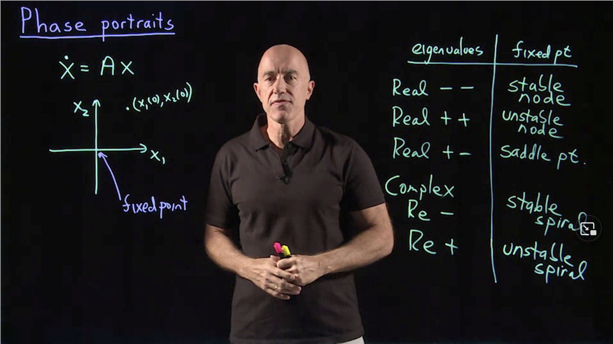{:height 323, :width 563}
				- #### Stable and unstable nodes
					- for $$ \mathbf{\dot{x}} = \mathbf{A} \mathbf{x} $$
						- | eigenvalue | fixed point |
						  | 2 negative real values| stable node, trajectories converge to origins |
						  | 2 positive real values | unstable node |
						  |one positive, one negative value| saddle point| 
						  | complex, real part negative | stable spiral |
						  | complex, real part positive | unstable spiral|
					-
			-
			-
	- ## PDE
		- ### Diffusion Equation
			- 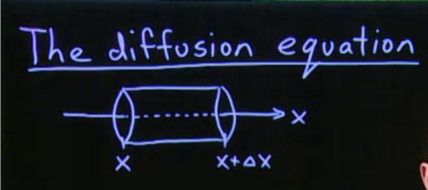
				- Definition:
					- $u(x, t)$: mass per unit length
					- $$
					  M = u(x, t) \Delta X \\
					  $$
					- $\frac{dM}{dt}$ = flux-in - flux-out
						- = $J(x, t) - J(x + \Delta x, t)$
					- Fick's Law of Diffusion
						- $$
						  J(x, t) = - D u_x(x, t)
						  $$
						- Diffusion Coefficients
							- ${length}^2 / time$
					- Final Equation:
						- $$
						  U_t( x, t) \Delta x = D(U_x(x + \Delta x, t) - u_x(x, t)) \\
						  U_t(x, t) = D \frac{U_x(x + \Delta x, t) - u_x(x, t)}{\Delta x} \\
						  \Delta x \to 0: u_t = D u_{xx}
						  $$
						- one-dimensional diffusion equation
				- Solution
					- Separate Variables
						- Use ansatz $u(x, t) = X(x) T(t)$
							- $$
							  X T' = D X'' T \\
							  \frac{X''}{X} = \frac{1}{D} \frac{T'}{T} = -\lambda
							  $$
								- $\lambda$ is called seperation constant
								- We get ODEs
							- $$
							  X'' + \lambda X = 0 \\
							  T' + \lambda D T = 0
							  $$
					- Slove $X(t)$
						- Boundary Condition
							- 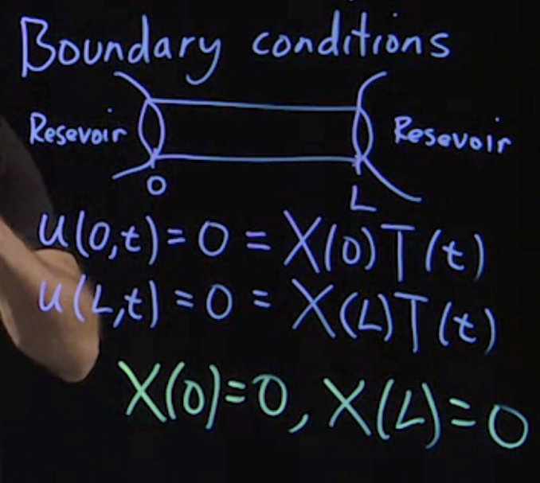{:height 310, :width 349}
								- Homogeneous Dirichlet B. C.
							- $\lambda < 0$, there will be no solution
							- So assume $\lambda = \mu^2$, then:
							  $$
							  X'' + \mu^2 X = 0
							  $$
							- Solve $X(x)$:
								- $$
								  X(x) = A \cos{\mu x} + B \sin{\mu x}
								  $$
							- Initial Value:
								- $$
								  X(0) = A = 0, X(L) = B \sin{\mu L} = 0
								  $$
								- We can get
								  $$
								  \sin{\mu L} = 0 \\
								  \mu = \frac{n \pi}{L} \\
								  \lambda_n = \mu_n^2 = \frac{n^2 \pi^2}{L^2} \\
								  X_n = \sin{\frac{n \pi x}{L}, n = 1, 2, 3, \dots}
								  $$
								  B is contant so is removed.
								  $\lambda_n$ and $X_n$ are eigenvalues and eigenvectors
					- Fourier Series Solution (Diffusion Equation)
						- $$T' + \lambda_n D T = 0$$
						- We can get $T_n$:
						  $$
						  T_n(t) = \exp{\frac{- n ^2 \pi^2 D}{L^2} t}
						  $$
						- Then we can get $u_n(x, t)$
						  $$
						  u_n(x, t) = X(t) T_n(t) = \sin{\frac{n \pi x}{L}} \exp{\frac{- n ^2 \pi^2 D}{L^2} t}
						  $$
						- Apply [superposition principle](((62aeb7fd-6e07-40fa-983a-4b16f6a47146))):
							- $$
							  u(x, t) = \sum_{n = 1}^{\infty} b_n \sin{\frac{n \pi x}{L} } \exp{\frac{- n ^2 \pi^2 D}{L^2} t}
							  $$
						- Initial condition
							- Specify what is the concentration in the pipr at $T = 0$
							- More General
								- $$
								  u(x, t=0) = f(x) = \sum_{n = 1}^{\infty} b_n \sin{\frac{n \pi x}{L}}
								  $$
									- This is a Fourier Series
									- We know $b_n$
									  $$
									  b_n = \frac{2}{L} \int_0^L f(x) \sin{\frac{n \pi x}{L}} dx
									  $$
							- All of the dye is concentrated right _in the middle of the pipe_ at $t = 0$, and  how that initial dye diffuses across the length of the pipe.
								- Here we use the [Dirac Delta Function](((62b03149-3161-4463-ad78-04ed2381d8ad)))
									- $$
									  f(x) = M_0 \delta(x - \frac{L}{2})
									  $$
								- We can wrote $b_n$ as:
								  $$
								  b_n = \frac{2 M_0}{L} \int_0^L \delta(x - \frac{L}{2}) \sin{\frac{n \pi x}{L}} dx = \frac{2M}{L} \sin{\frac{n \pi}{2}}
								  $$
								- Look at $n = 1$
									- If we're just interested in the longer time behavior, longer time here means that t is somewhat larger than L squared over d because this exponential function when n is larger than one will cause the terms to go to zero very fast.
									  So, the diffusion time is defined as L squared over d. So, if t is larger than that diffusion time, the most important term in this sum will correspond to n equals one. So, let's just look at the n equals one term.
									- $$
									  b_1 = 2 M_0 / L \\
									  u(x, t) = \frac{2 M_0}{L} \sin{\frac{n \pi x}{L}} \exp{\frac{- n ^2 \pi^2 D}{L^2}} t
									  $$
									- Look like this
										- 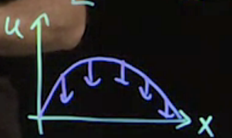{:height 208, :width 336}
										- decay in time:
			- C D B B C
- # Numerical Methods
  collapsed:: true
	- ## Euler Method
	  collapsed:: true
		- We need:
			- $$\frac{dy}{dx} = f(x, y)$$
			- Init Value:
				- $$y(x_0) = x_0$$
		- We get:
			- $$y_n = y_{n-1} + \delta x f(x_{n-1}, y_{n-1})$$
		- Or can be written:
			- $$k_1​=Δxf(x_n​,y_n​),y_{n+1}​=y_n​+k_1​,$$
		- We need differential solutions exist and unique.
	- ## Runge-Kutta method
		- 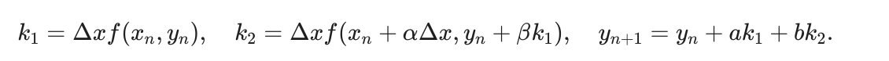
		- Some analysis (not shown here) on the second-order Runge Kutta methods results in the constraints
			- 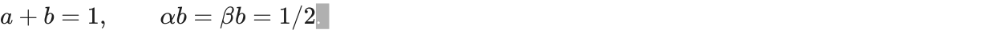
			- modified euler method, $a=b$
				- 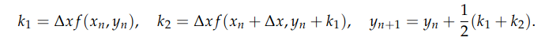
			- midpoint method$a = 0$
				- 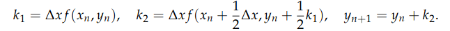
- # Appendix
	- ansatz
	  id:: 62a9cf47-d828-41e8-b20c-1843ebbf14f4