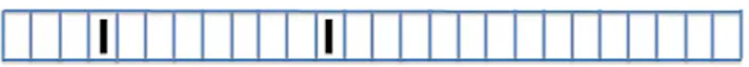
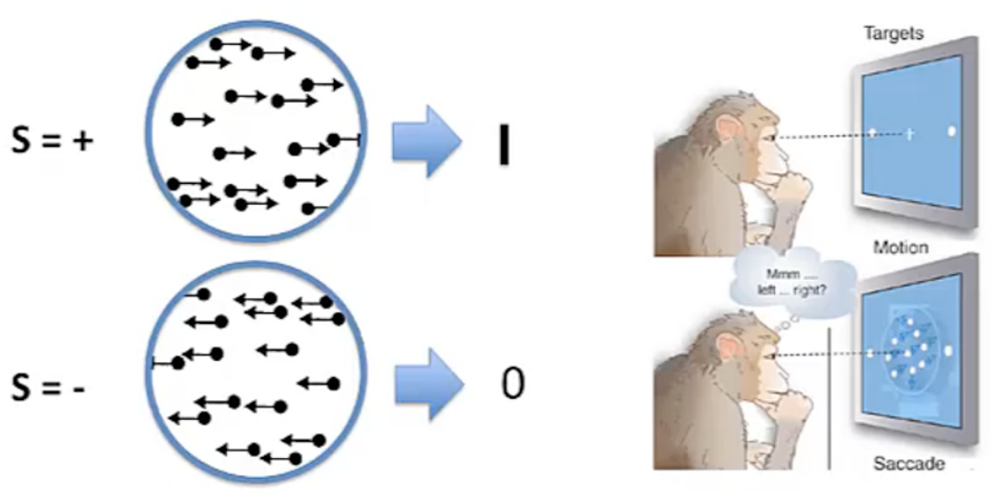

- Content 
  collapsed:: true
- * How good a code do ((61e5833c-0dbd-405b-8b91-e4d7ac43547c))s  represent?
  * We use information theory as a way to understand **coding properties**.  
  
  
  * Defining ((61e58565-3ebd-4ff4-af9b-705f8f9234e5)) and ((61e58439-5d1b-43b2-a64d-af5b096011c2)) 
  * Computing Information for neural spike trains
  * What can inforamtion tell us about coding
- {{renderer :tocgen}}
- # Origin
	- [[ref: A Mathematical Theory of Communication]]
- # Spike Train 
  id:: 61e5833c-0dbd-405b-8b91-e4d7ac43547c
  collapsed:: true
	- is a time sequence in which we are marking spikes, in a given time bin, with a one and silence with nothing.
	- {:height 81, :width 564}
	  id:: 61e64dba-e07f-451c-b989-c96c98308406
	- {:height 81, :width 564}
	- When oddball symbols appeared, either stimulus or spike, you felt a bit of _surprise_,  So ((61e58439-5d1b-43b2-a64d-af5b096011c2)) quantifies that **degree** of suprise
- # Information
  id:: 61e58439-5d1b-43b2-a64d-af5b096011c2
  collapsed:: true
	- Example: +
	   
	  + 1 - black in time bin, spike
	  + 0 - white in time bin, slience
	  
	  #+BEGIN_EXPORT latex
	  \begin{align*}
	  P(1) &= p \newline
	  P(0) &= 1-p \newline
	  Information(1) &= -\log_2^p \newline
	  Information(0) &= -\log_2^{(1-p)}
	  \end{align*}
	  #+END_EXPORT
	  
	  $Information(1)$ is the information we get from seeing a spike and $Information(0)$ is the information we get from seeing a slience
- # Entropy
  id:: 61e58565-3ebd-4ff4-af9b-705f8f9234e5
  collapsed:: true
	- A fancy word for uncertainty, we need to quantify this uncertainty
	- Definition: 
	  Entropy is simply the average information of a random variable. 
	  Entropy mesures the _variablity_
	  \begin{align*} 
	  H &= average information \newline
	  &= -\sum^i p_i \log_2^{p_i} \newline
	  &= -\int dx p(x) \log_2^{p_i}
	  \end{align*}
	- Why $\log_2$ ?
	  Entropies are always computed in log base 2 and their units are in _bits_.
	  An intuiitive way to think out is that the entropy counts the number of **yes and no** questions.
	- Entropy of a probability distribution tells us **how uncertain** we are about the distribution.
	-
- # Quantifying Variablity
  collapsed:: true
	- We use ((61e58565-3ebd-4ff4-af9b-705f8f9234e5)) to quantify _variablity_
	- Encoding replies on the ability to generate stimulus driven variations in the **output**. If out put has no variations like [img](((61e64dba-e07f-451c-b989-c96c98308406))), we are not very optimistic about its ablity to encode inputs.
	- ## Maximizing Entropy
		- What dose **having a large entropy** do for a code? It gives the most possibility for representing inputs. The more intrinsc variability there is, the more capacity that code has for representation.
	- ## Mutual Information
		- Now we can find the intrinsic variablity of our _outputs_, but obviously we really need to consider the stimulus, and **how it's driving responses.**
		- ### Example
		  collapsed:: true
			- {:height 305, :width 602}
			- #### Cases:
				- {:height 77, :width 332} 
				  response is encoding the stimulus and there are several envents that are misdires.
				- {:height 58, :width 341}
				  Seems to be no relationship between resopnses and stimulus.
			- #### How do we know what our stimulus was?
			  collapsed:: true
				- What if the problem is not that the code is noisy? But we havn't understood what the code is doing. That is, maybe there's some temporal sequencing S that should be more appropriately thought about as the true stimulus.
		- ### Main Question:
			- What we really wanted to know is; how much of the variability that we see in $R$ is actually used for encoding $S$?
			- We need to incorporate the possibilityfor error.
		- ### Definition
			- The amount of entropy that is **used in coding the stimulus**.
			-
			  $$
			  MI(S,R) = Total Entropy - Average Noise Entropy
			  $$
			-
			  $$
			  MI = -\sum_r p(r) \log_2 p(r) - \sum_s p(s) [ -\sum_r p(r|s) \log_2 p(r|s) ]
			  $$
			- NOW Computation of entropy/mutal information for Continous Distribution
			  :LOGBOOK:
			  CLOCK: [2022-01-26 Wed 11:09:23]
			  :END:
			- **Steps**:
			  1. Take one stimulus $s$ and repeat many times to obtain $P(R|s)$
			  2. Compute variablity due to noise: _noise entropy_  $H[R|s]$
			  3. Repeat for all $s$ and average: $\sum_s P(s) H[R|s]$
			  4. Compute $P(R)=\sum_s P(s) P(R|s)$ and the total entropy $H[R]$
				-
				  $$
				  I(S;R)=H[R] - \sum_sP(s) H[R|s]
				  $$
			- [What] Mutal information is the difference between total response entropy and the mean noise entropy
			- Information quantifies how _independent_ $R$ and $S$ are:
		- ### Extreme Conditions
			-
			  collapsed:: true
			  1. Response is unrelated to stimulus: $p(r|s)=p(r)$, $MI=0$
			  2. Response is perfectly predicted by stimulus: The noise entropy is $0$, the mutual information will be given by the total entropy of the response. All od the response's coding capacity is used in encoding the stimulus.
		- * given stimulus to obtain $P(R|S)$ 
		  * Compute _noise entropy_
	- ## Information in Single Spikes
- # Calculating information In ((61e5833c-0dbd-405b-8b91-e4d7ac43547c))
  collapsed:: true
	- Compute Information in Spike Patterns
	- Compute Information in Single spikes
- # Coding Effciency
	- Propeties of Natural Input Stimuli
		- 1. Huge Dynamic Range
		  2. Power Law Scaling
		-
	- Efficient Coding
		- To have maximum entropy output, a good encoder should match its output to the distribution of its input.
			- The stimulus ( $s(t)$)to encode
			  
			- The distribution of stimuli
			  {:height 210, :width 172}
		- Our job as an encoder is to map the stimulus onto the systems that we have at our disposal.
	- Neural population should be as sparse as possible, that is that coding properties should be orgnized so that as few neurons as possible are firing at any time.
	  id:: 62178757-c58d-442e-b423-909edf768397
	- Representing natural scenes sparsely
		-
		  $$
		  I(\vec{x}) = \sum_{i} a_i \phi_{i}(\vec{x}) + \epsilon(\vec{x}) \\
		  E = \sum_{\vec{x}}  \left[ I(\vec{x}) -  \sum_{i} a_i \phi_{i}(\vec{x}) \right]^2 + \lambda \sum_{i} C(a_i)
		  $$
			- $I(\vec{x})$ image
			- $\phi_i(\vec{x})$ basis function, with which to reconstruct a natural scene.
			- $a_i$ weighted coefficient over basis function
			- $\epsilon(\vec{x})$ additional noise.
			- $\left[ I(\vec{x}) -  \sum_{i} a_i \phi_{i}(\vec{x}) \right]^2$ means squared difference between the reconstructed image and the image itself
			- $\lambda \sum_{i} C(a_i)$ cost term, whose role is to count how many coefficients are needed.
				- One simple choice of this cost function, is just the absolute value of these coeffcients
				  $$
				  C(a_i) = |a_i|
				  $$
		- So that [as few coefficients $a_i$ as possible]((62178757-c58d-442e-b423-909edf768397)) are needed in general to represent an image. This is carried out by minimizing a function that includes the reconstruction error.
		-
- Coding Principles
	- Coding Efficiency
	- Adaption to stimulus statistics
	- Sparseness