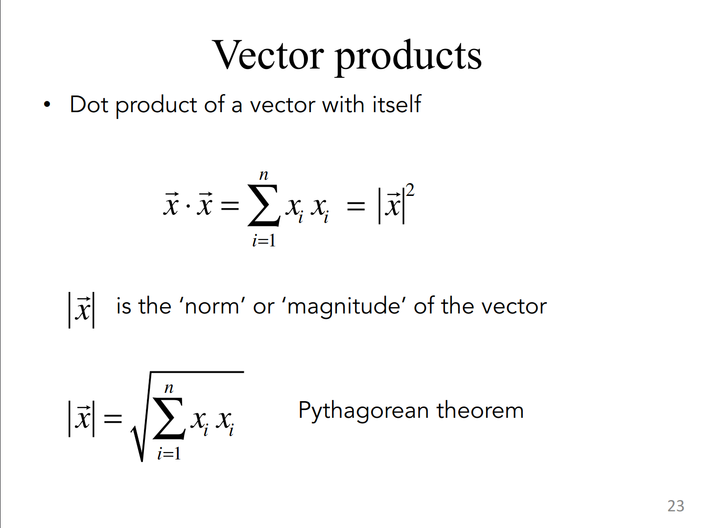
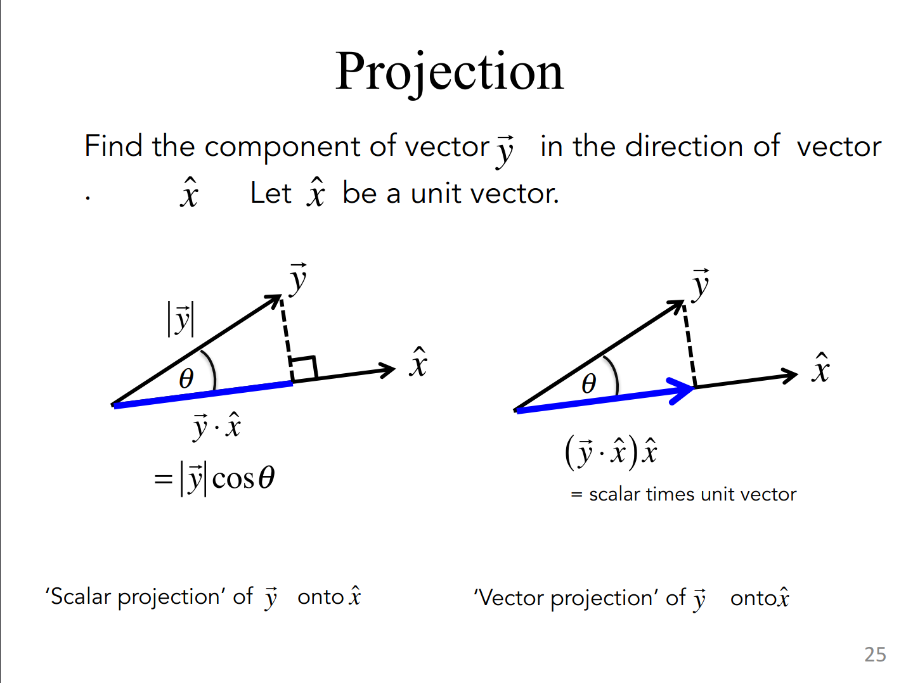

- # Vector Operation
  collapsed:: true
	- ## sum
	- ## products
		- ### Element-by-element (Hadamard product)
		- ### Inner/Dot product
		  collapsed:: true
			- it's a scalar, only a simple number
			- #### properties:
			  collapsed:: true
				- commutative
					- $$
					  x \dot y = y \dot x
					  $$
				- distributive
				- linearity
			- Others
				- dot product of a vector with itself
					- {:height 274, :width 386}
				-
		- ### Outer
		- ### Cross Product
		- ### Projection
			- {:height 369, :width 488}
- # Linear Equation
- # Matrix
	- ## Trace
		- The trace of an $n \times n$ square matrix $\mathbf{A}$ is defined as:
			- $$Tr(\mathbf{A}) = \sum_{i = 1}^{n} a_{ii} = a_{11} + a_{22} + \dots + a_{nn}$$
	- ## Determinate
		- Matrix $\mathbf{A}$ is invertible if $\det{\mathbf{A}} \neq 0$
- # Eigenvalue & Eigenvector
  id:: 62aeb7fd-8132-44dd-89f9-90bbf55572ad
	- 特征值与特征向量
	- $$A x= \lambda x$$
	- $\lambda$ is the eigenvalue
	- $$ 
	  \begin{align*}
	  Ax = \lambda I x \\
	  (A - \lambda I) x &= 0
	  \end{align*}
	  $$
	- We don't want $x$ to be 0, so the $(A - \lambda I )$ is non-invertible so:
		- $$\det{A - \lambda I} = 0$$
			- So called **characteristic equation** of the matrix A
			- If $A$ is 2D matrix, the equation would be quadratic, for $A$ is 3D matrix, the equation would be cubic, and so on.
	- Solve the equation:
		- $$
		  \begin{align*}
		  \det{
		  \begin{pmatrix}
		  a - \lambda & b \\
		  c & d - \lambda
		  \end{pmatrix}
		  } &= (a - \lambda)(d - \lambda) - bc \\
		  &= \lambda^2 - (a+d) \lambda + ad - bc \\
		  &= \lambda^2 - Tr{A} \lambda + \det{A}
		  \end{align*}
		  $$
	-
	- Eigenvectors are the '$x$' associated with the relevant $\lambda$
		- for $\lambda = \lambda_1, \lambda = \lambda_2$
		- $\lambda = \lambda_1: (A - \lambda_1I)v_1 = 0$
		- The $v_1$ is the eigenvector