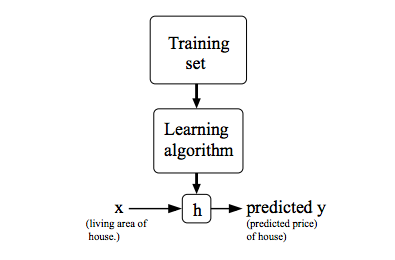
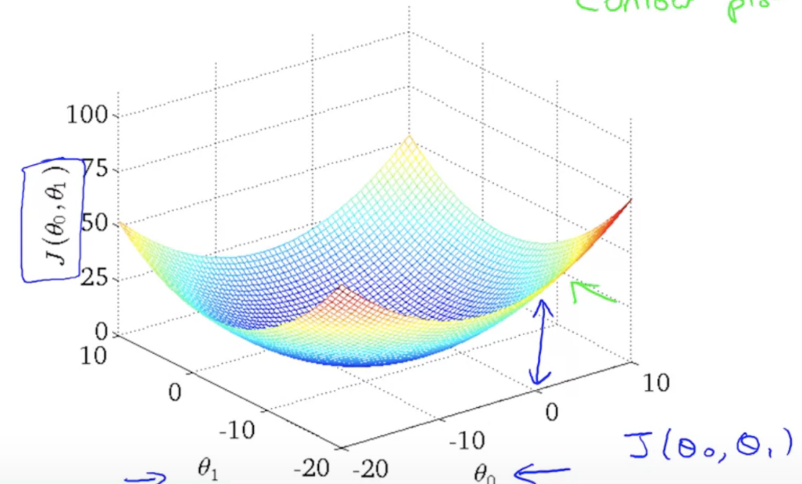
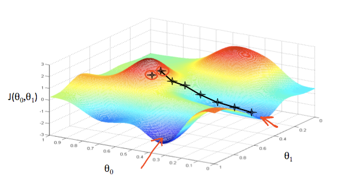
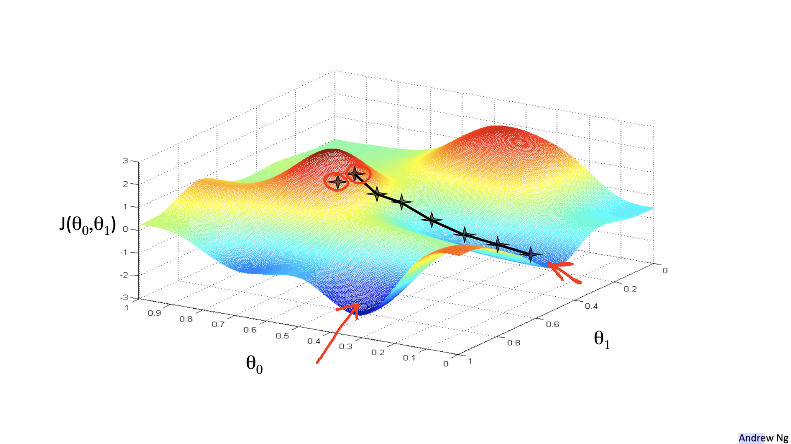
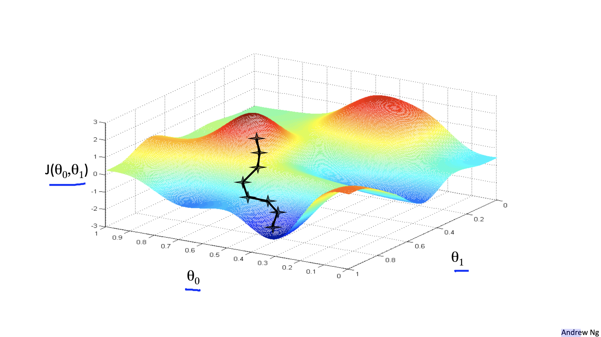
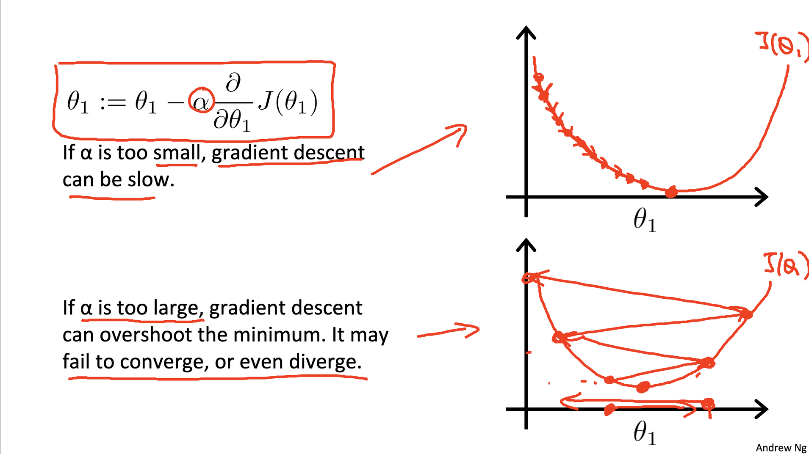
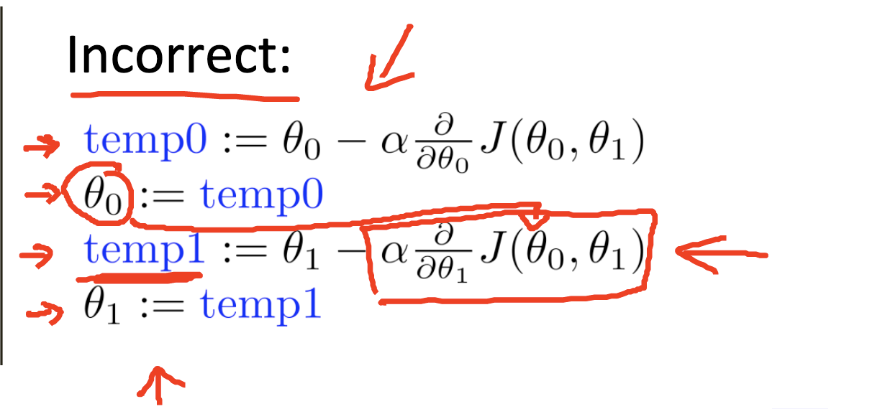
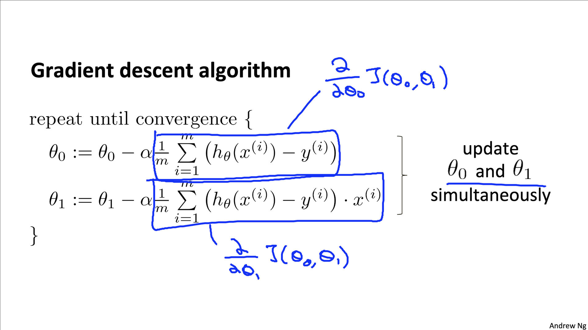
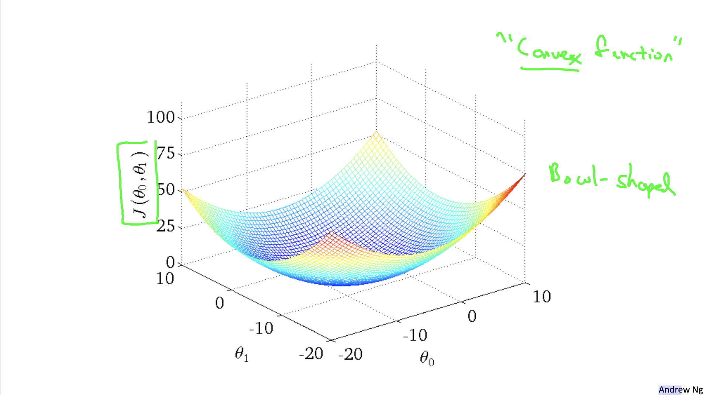

- # Model Representation & Cost Function
	- ### In **Supervised Learning**
	  collapsed:: true
	  
	  * $x^{(i)}$ is *ith* input variable, $y^{(i)}$ is *ith* output variable what we're trying to predict
	  * A pair $(x^{(i)}, y^{(i)})$ is called a **training example**,
	  * Dataset that is used to learn $(x^{(i)}, y^{(i)}); i = 1, ..., m$ is called a **training set**.
	  * **hypothesis**: $h: X -> Y$, $h(x)$ is the predictor for corresponding value of $y$
		- 
		- Hypothesis: $h_\theta(x) = \theta_0 + \theta_1x$
		  
		  Parameters:  $\theta_0, \theta_1$
		  
		  Cost Functions: $J(\theta_0, \theta_1)$
		  
		  Goal: **minimize** $J(\theta_0, \theta_1)$
		- 
			- or countour plot  （等值线图）
	- ## Cost Function
	  collapsed:: true
		- Measuring the **accuracy** of our hypothesis function
		  
		  For **linear regression,** one kind of cost function is: 
		  
		  $$
		  J({\theta}_0,{\theta}_1)
		  =\frac{1}{2m}
		  \sum_{i=1}^m
		  (\hat{y}_i−y_{i})^2
		  =\frac{1}{2m}
		  \sum_{i=1}^m
		  (h_\theta(x_i)-y_i)^2
		  $$
		  
		  $m$ is the number of training example
		  
		  This function is otherwise called the "Squared error function", or "Mean squared error". The mean is halved $(\frac{1}{2})$ as a convenience for the computation of the **gradient descent**, as the derivative term of the square function will cancel out the $(\frac{1}{2})$ term.
	- ## Gradient Descent
	  collapsed:: true
		- Have Some functions $J(\theta_0, \theta_1)$
		  
		  Want ${min\atop \theta_0, \theta_1}  J(\theta_0, \theta_1)$
		  
		  Gradient descent can converge to a local minimum, even with the learning rate α fixed.
		- ### Outline:
			- * Start with some $\theta_0$, $\theta_1$
			  * Keep changing $\theta_0$ and $\theta_1$ a little bit to try to reduce $J(\theta_0, \theta_1)$ , until hopefully end up at a minimum, or maybe at a **local minimum**.
			  
			   
			  
			  We put $\theta_0$ on the x axis and $\theta_1$ on the y axis, with the cost function on the vertical z axis. The points on our graph will be the result of the cost function using our hypothesis with those specific theta parameters.
			- 局部最有 ≠ 全局最优
				- 
				- 
- # Gradient Descent Algorithm
  collapsed:: true
	- repeat until convergence (收敛)  
	  
	  $$
	  \theta_j \colonequals \theta_j - \alpha \frac{\partial}{\partial \theta_j}J(\theta_0, \theta_1)\quad (for \ j = 0 \ and \ j = 1 )
	  $$
	- ### What for:
	  collapsed:: true
		- To estimate the parameters in the hypothesis function by minizing the values of cost function
	- ### Learning rate - $\alpha$
	  collapsed:: true
		- It basically controls how big a step we take downhill with creating descent.
		- 
	- ### Update $\theta_0$ and $\theta_1$ **simultaneously,**
	  collapsed:: true
		- compute the right part and update them
		  * temp0 := $\theta_0 - \alpha \frac{\partial}{\partial \theta_0}J(\theta_0, \theta_1)$
		  * temp1 := $\theta_1 - \alpha \frac{\partial}{\partial \theta_1}J(\theta_0, \theta_1)$
		  * $\theta_0$ := temp0
		  * $\theta_1$ := temp1
		- TODO Why ?
		- Incorrect, use the new $\theta_0$ compute new $\theta_1$
		- 
	- Notation:
	  collapsed:: true
		- Assignment: $a \colonequals b$
		- Truth Assertion: $a = b$
	- 
	-
	- ### Solve partial derivetive
	- ### "Batch" Gradient Descent
		- "Batch": Each step of gradient descent uses all the trainning examples.
- # Linear Regression Model
  collapsed:: true
	- ### H**ypothesis Function**
		- $$
		  h_\theta(x) = \theta_0 + \theta_1x
		  $$
	- ### Cost Function
		- $$
		  J({\theta}_0,{\theta}_1)
		  =\frac{1}{2m}
		  \sum_{i=1}^m
		  (\hat{y}_i−y_{i})^2
		  =\frac{1}{2m}
		  \sum_{i=1}^m
		  (h_\theta(x_i)-y_i)^2
		  $$
	- ### Gradient Descent
		- **Solve Partial Deritive**
			- When  $\theta = 0$
				- $$
				  \frac{\partial}{\partial \theta_0}J(\theta_0, \theta_1) = \frac{1}{m} \sum^m_{i = 1}(h_\theta x_i - y_i)
				  $$
			- When $\theta = 1$
				- $$\frac{\partial}{\partial \theta_0}J(\theta_0, \theta_1) = \frac{1}{m} \sum^m_{i = 1}(h_\theta x_i - y_i)x_i$$
		- 事实证明，用于线性回归的Cost Function，总是会变成变成一个凸函数 (Convex Function/ Bowl-Shaped Function)，只有全局最优解。
		  collapsed:: true
			- 
			- 