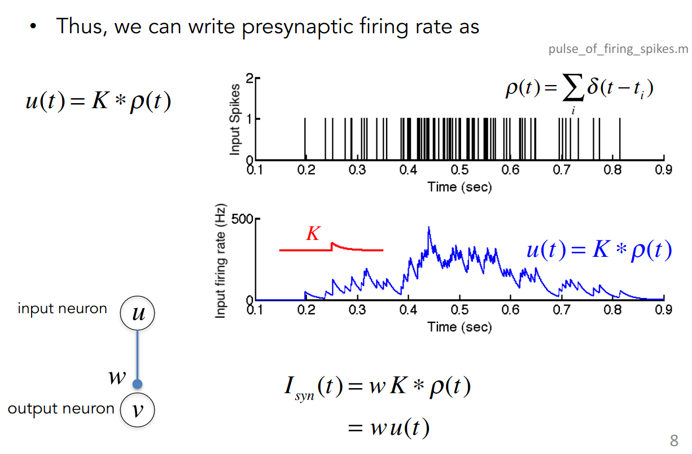

- {{query (and (todo todo doing) (page <% current page %>))}}
  query-table:: false
  query-sort-by:: block
  query-sort-desc:: true
- # Rate Model
	- ## Simple Model
		- Ignore spike times, and describe the inputs and outputs of our neurons simply as **firing rate**
			- {:height 211, :width 536}
		- Neurons are connected by **synapses** replaced by **synaptic weight** $w$,  The complex structures of synapses, vesicle release, neurotransmitter receptors, long-term depression balabala to be ingnored.
		-
		- Justify going from spikes to firing rates
		- Examine the response of the output neuron to a single input spike.
		- ## Input Neuron
			- ### Single Input
				- Remember that the response of a real output neuron, a real neuron, to a single spike at its input, is some change in the **postsynaptic conductance** ($\hat{G}_{syn}$)that follows an input spike as the pic shows:
					- 
				- And in our model of a synapse, we described that the input spike produces a _transient_ 
				  _increase_ in the synaptic conductance. And that **synaptic conductance** we modeled
				  as a simple step increase in the conductance followed by an ***exponential decay*** _(as the equation below)_ as the neurotransmitter gradually unbinds from the neurotransmitter receptors.
					- 
				- postsynaptic current $\hat{I_{syn}}$:
					- 
					- Ignore the synaptic saturation
						- TODO What is synaptic saturation
					- just imagine that the synaptic current is just proportional to the
					  synaptic conductance.
				- Now we can write the conductance as just some weight times a **kernel** that is just
				  some kernel of unit area.
					- TODO What is kernel? @ Lecture 7
					- 
					- So what we've done here is we've just taken the synaptic
					  current and we've written it as a constant, a synaptic weight, times an exponentially decaying kernel of area, area 1.
			- ### Multiple Inputs - Spike Train
				- #### train of spikes:
					- a sum of delta functions where the spike times are $t_i$
						- {:height 99, :width 206}
						- TODO What is delta funtion and how spike train is represented?
					- Convolve the input spike train with the synaptic _expotential_ kernel, giving us the **synaptic current** that results from the spike train
						- {:height 222, :width 535}
						- And if you want to **plot the synaptic current** as a function of time, you would just take that spike train input and do what with that linear kernel?
						  We would **convolve** it, right?
							- TODO convolution @ Lecture 10
							- TODO Why convolove it
						- {:height 88, :width 293}
				- #### Quantity:
					- $K$ is a little kernel that has an exponential step, and then an exponential decay
					- What do you get when you convolve that kind of smooth kernel with this spike train here? What does that look like?
						- It's sort of a smoothed version of a spike train
						- It's like a low-pass version of the spike train
							- TODO What is low-pass window/version of spike train
							- TODO  in the lecture on firing rates, we talked about how that's a good way to get a time-dependent estimate of the firing rate of a neuron.
					- We have that the current is just a constant times an estimate of the
					  firing rate at that time.
					- If k is a kernel, a smooth kernel with an area normalized to 1, then this quantity is just an estimate of the firing rate
						- if the area of that smooth window is 1, then what we're doing is we're
						  estimating the **firing rate of the neuron as a function of time**.
							- you remember that if k has an area 1, then when you convolve evolve that kernel with the spike train, you get a number that has units of spikes per second. And that quantity is an estimate of the local firing rate of the neuron
						- 
					-
				- #### Conclusion:
				  collapsed:: true
					- 
		- ## Output Neuron
		  collapsed:: true
			- Output neuron firing rate $v$ is _some function_ $F$ of the input neuron
				- $$
				  v = F[I_s] = F[wu]
				  $$
				- As:
					- {:height 150, :width 266}
						- The steady-state firing rate of the neuron had a threshold current below
						  which the neuron would not spike, and some increasing f.r. above
						  threshold.
					- 1. When input current below the threshold, the output current = 0
					  2. When input current above the threshold, the output current is linear/proportionally with Input current. (actually can be non-linear, anyway, its a function)
					  3.
		- ## Linear Rate Model
		  collapsed:: true
			- {:height 481, :width 631}
				- Cons:
					- Negative Current
				- Pros:
					- Easy to derive mathmatically,
					- Easy to analyze network structure
		- ## Multiple Inputs
		  collapsed:: true
			- 
	- ## How to build a receptive field
	  collapsed:: true
		- we described how a neuron can have a maximal response to a particular pattern of input.
		- ### 1D Receptive Fields
			- 
				- `1, 2, 3, 4, 5` are input neurons
				- Set their weights
		- ### 2D Receptive Fields
			- 