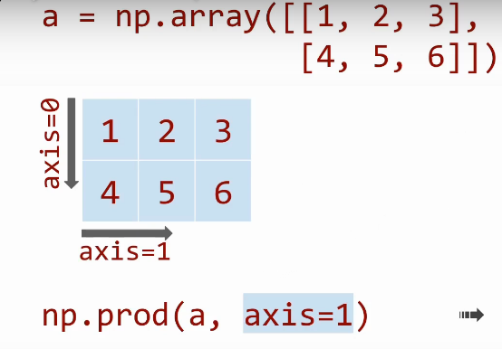

- `np.arrange`
- `np.reshape`
-
- Slice
	- ```
	  >>>a = np.array([[1, 2, 3], [4, 5, 6]])
	  >>>a
	  array([[1, 2, 3],
	  [4, 5, 6]])
	  >>>a[:, -1]
	  array([3, 6]
	  ```
-
- aggreation
	- aggregation operations go along the axis
	- 
	- ```
	  a = np.array([
	      [1, 2, 3],
	      [4, 5, 6],
	  ])
	  np.sum(a, axis=0)
	  np.prod(a, axis=1)
	  array([5, 7, 9])
	  array([  6, 120])
	  ```