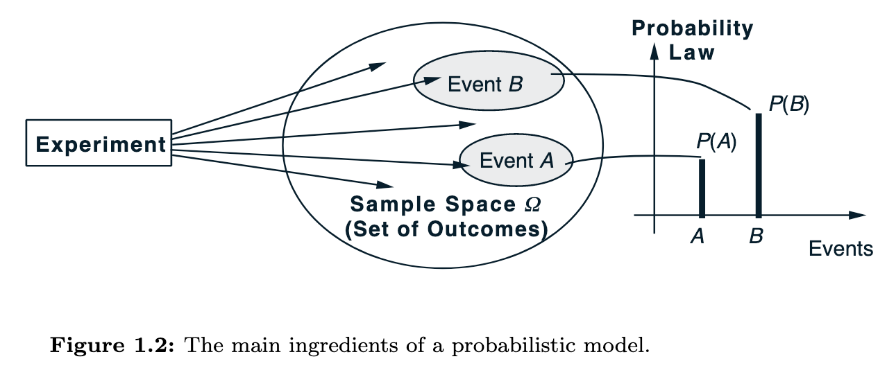

- # Probability Models & Axioms
  heading:: true
  id:: 61e3cb9c-b543-4a8f-a2c0-03b9859d7e0f
	- ## Probabilistic Models
	  collapsed:: true
	  A probabilistic model is a mathematical description of an uncertain situation. It has 2 ingrediants
		- **The Sample Spcae** $\Omega$: the set of all **possible** _outcomes_ of an experiment
		- **The Probability Law**: 
		  which assigns to a set A of possible outcomes (also called an event) a nonnegative number P(A) (called the proba- bility of A) that encodes our knowledge or belief about the collective “likelihood” of the elements of A. The probability law must satisfy certain properties to be introduced shortly.
		- 
		- **Experiments**: Every probabilistic model involves an underlying process, that will produce exactly one out of several possible outcomes
		- **Event**: A subset of the sample space, that is, a collection of possible outcomes, is called an event.
		- Regardless of their number, different elements of the sample space should be
		  distinct and **mutually exclusive** so that when the experiment is carried out,
		  there is a unique outcome.
		- [[ref: Introduction to probability]] at page: 16
	- ## Axioms
	  collapsed:: true
		- **Nonnegativity**
			- for every event $A$
			  $$
			  P(A) >= 0
			  $$
		- **Additivity**
		- **Normalization**
			- The probability of the entire sample space Ω is equal to 1, that is,
			- $$P(Ω) = 1.$$
- # Probability
  collapsed:: true
	- Basic Rules of Probability
		- Definition:
			- #+BEGIN_EXPORT latex
			  P(A) \in [0, 1]
			  #+END_EXPORT
		- Complimentary:
			- $$
			  P(\neg{A}) = 1 - P(A)
			  $$
		- Joint Probability
			- $$
			  P(A \cap B) = P(A, B) =  P(B|A)P(A) = P(A|B)
			  $$
		- Conditional Probability
			- $$
			  P(A | B) = P(A \cap B) / P(B)
			  $$
		- Marginal Probability
			- $$
			  P(A) = \sum_B P(A, B) = \sum_B P(A|B) P(B)
			  $$
	-
- # Bayes' Theorom
  collapsed:: true
	-
- # Central Limit Theorm
  id:: 62c985ed-45b1-4939-b1e1-0f030edf3bb9
- # Markov Chains
	- Property
		- current state all that matters
	- System transitions $s_1, s_2, s_1, s_3, s_3, \dots$
	- Transition probabilities
	- Model simplified behavior, cell etc.
	- Example:
	  collapsed:: true
		- |t \ t+1| s_1 | s_2 | s_3|
		  |s_1| 0 | 0.3 | 0.7|
		  |s_2| 1 | 0 | 0 |
		  |s_3 | 0 | 0.5 | 0.5 |
	-
-
-