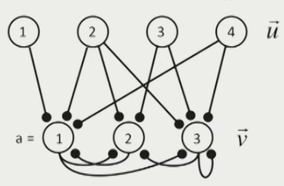
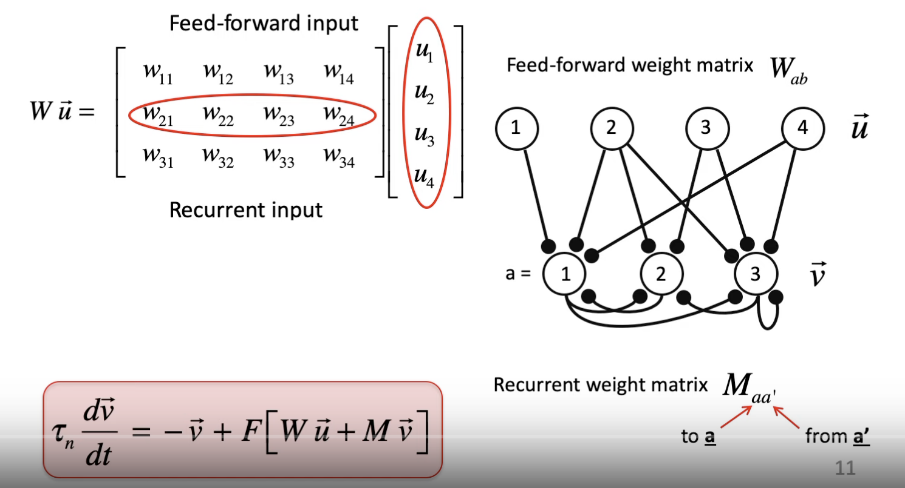
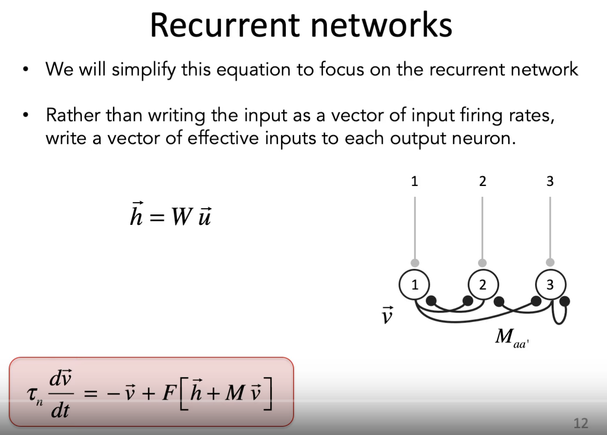
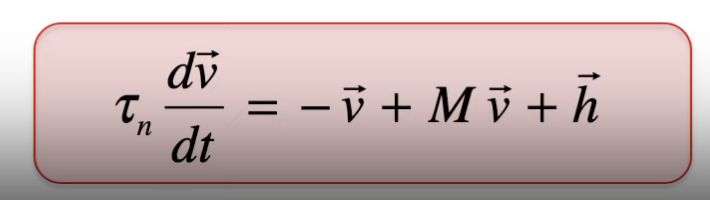
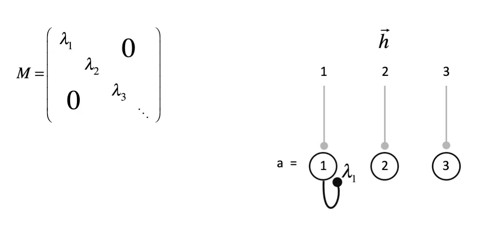
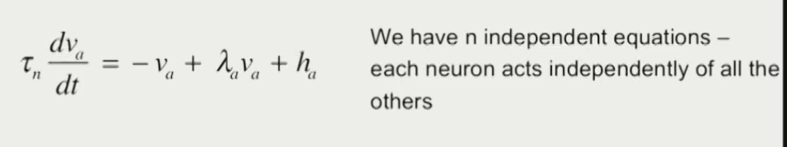
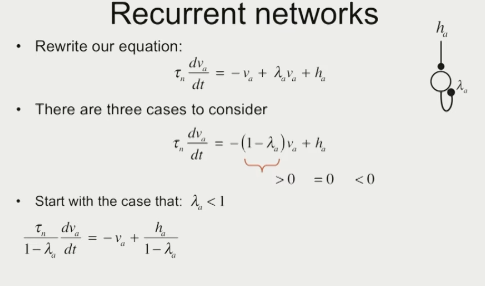
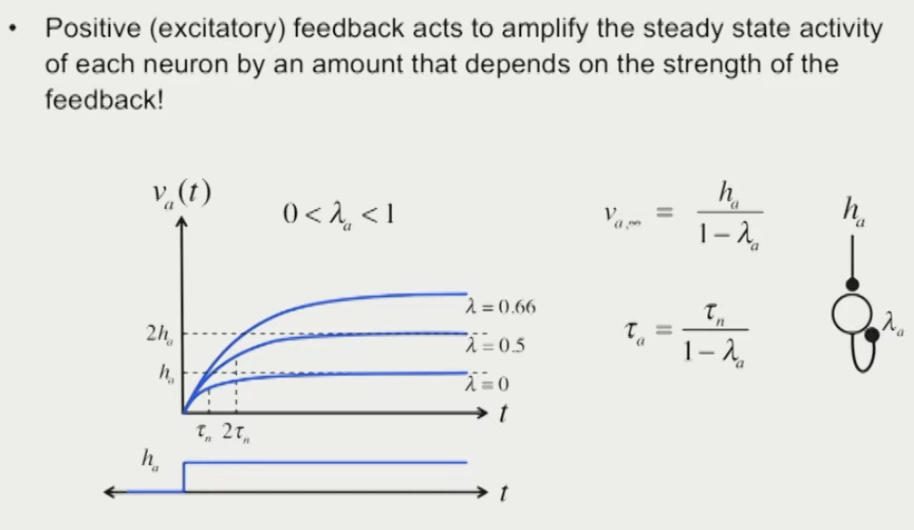
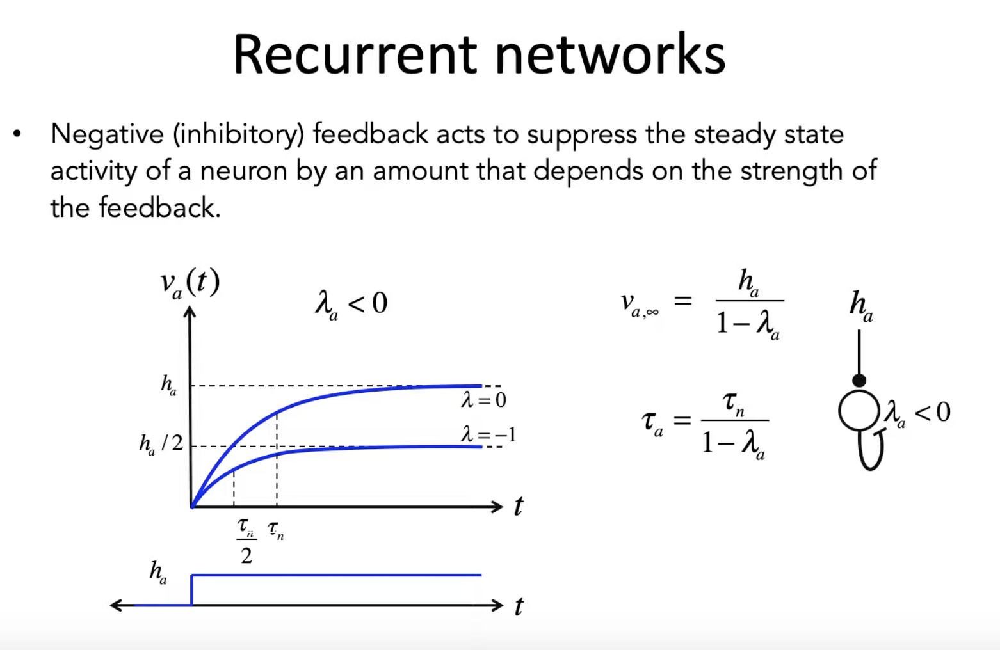
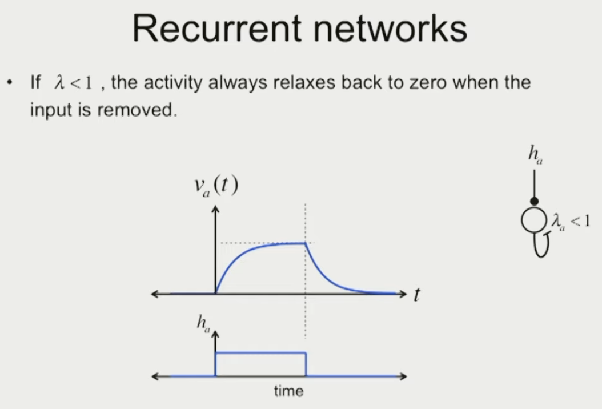

- Connections between the output layer
	- {:height 252, :width 359}
- #  Mathematical Description
	- Basic
		- $v$ firing rate of ouput neurons, $u$ firing rate of input neurons.
		- $F$ means weights
		- {:height 266, :width 473}
	- Simplify the equation we get:
		- {:height 345, :width 440}
	- Ultimate Equation:
		- $$
		  \tau_n \frac{d \vec{v}}{dt} = -\vec{v} + F [\vec{h} + M \vec{v}]
		  $$
	- Let's Solve the euqation:
		- For Linear neurons, which the firing rate is linear for the input:
			- {:height 118, :width 448}
			- Example:
				- Autapse:
					- A diagonal matrix, means the neuron make connnection with himself.
					- This is a autapse
						- {:height 239, :width 527}
					- Wirte equation for each independent neuron
						- 
					- Rewrite the equation
						- {:height 122, :width 167}
					- We have 3 situantions for $\lambda$
						- 
							- but $\tau$ is slower
						- 
							- $\tau$ is faster
						- 
					- How do we represent the response of a network of neurons.:
						- State-space trajectories
				- Fully-Recurrent Network
					-