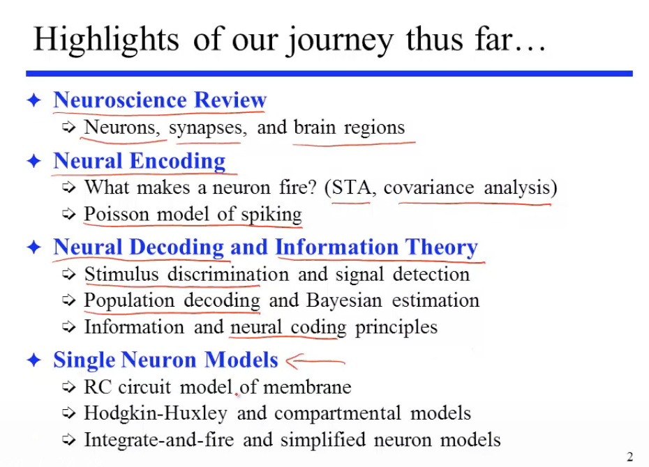

- {{query (and (todo todo doing) (page <% current page %>))}}
  query-table:: false
- Math
  collapsed:: true
	- [[Calculus]]
	- [[Linear Algebra]]
	- [[Probability & Statistics]]
	  collapsed:: true
		- [[Distribution]]
		- [[Random Number]]
	- {{renderer :tocgen, [[Differential Equation]] , 4, h}}
	  collapsed:: true
		- [[Elementary Differential Equations and Boundary Value Problems]]
	- [[Dynamical System]]
	- [[Linear Dynamical Systems]]
	- ((Poi))
	- Appendix
		- [[Complex Number]]
		- [[Convolution]]
		- [[Linear Kernel]]
		- [[Linear Functions]]
		- DOING Euler Formula
		  :LOGBOOK:
		  CLOCK: [2022-06-17 Fri 15:12:42]
		  :END:
	- [[Questions]]
- [[Machine Learning]]
- [[CompNeuro]]
  collapsed:: true
	- [[Neural Encoding]]
	- [[Neural Decoding]]
	- [[Information Theory]]
	  collapsed:: true
	- [[Computing in Carbon]]
	  collapsed:: true
		- {:height 281, :width 373}
	- [[Computing with Networks]]
	  collapsed:: true
		- How do neurons connect to from networks
	- [[Neuron Networks by MIT OCW]]
		- [[Recurrent Network]]
	- [[Continuous Attractor Neural Network]]
		- https://github.com/chenhongbiao/Grid2PlaceModel
		- https://github.com/miyosuda/can
		- https://github.com/fccaa/cann_base
-
- Physics
  collapsed:: true
	- [[Circuits]]
- Scientific Computing
  collapsed:: true
	- [[NumPy]]
	- [[Matplotlib]]
-
- [[Modeling]]
-
- [[Plan 6.13 - 6.19]]