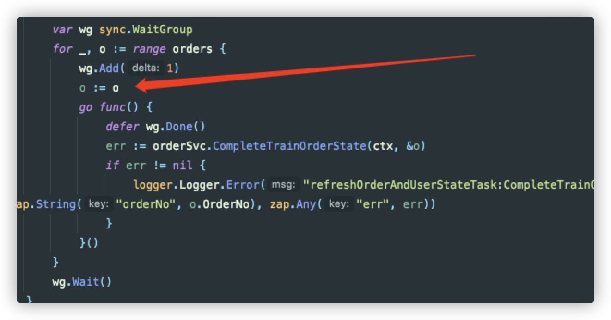

- # Goroutines
	- Goroutines run in the same address space, so access to shared memory must be synchronized.
	  src:: [[[ref]: A Tour of Go - Goroutines]]
- # Channels
	- ## channel
		- Go’s main method for synchronization is to use **channels**.
		- By default, sends and receives **block** until the other side is ready. This allows goroutines to synchronize without explicit locks or condition variables.
		  src:: [[[ref]: A Tour of Go - Channels]]
		- ### Basics
			- ### `make`  a channel
				- Like maps and slices, channels must be created before use:
				  
				  ```go
				  // unbuffered channel of ints
				  ic := make(chan int)
				  
				  // buffered channel with room for 10 strings
				  sc := make(chan string, 10)
				  ```
			- ### `send`  and `receive`
				- ```go
				  ic <- 3   // Send 3 on the channel.
				  n := <-sc // Receive a string from the channel.
				  ```
			- ### `<-` direction
				- ```go
				  chan Sushi    // can be used to send and receive values of type Sushi
				  chan<- string // can only be used to send strings
				  <-chan int    // can only be used to receive ints
				  ```
			- ### `range`
				- The loop `for i := range c` receives values from the channel repeatedly **until it is closed.**
					- ```go
					  package main
					  
					  import (
					  	"fmt"
					  )
					  
					  func fibonacci(n int, c chan int) {
					  	x, y := 0, 1
					  	for i := 0; i < n; i++ {
					  c <- x
					  x, y = y, x+y
					  	}
					  	close(c) // close channel, range stops
					  }
					  
					  func main() {
					  	c := make(chan int, 10)
					  	go fibonacci(cap(c), c)
					  	for i := range c {
					  fmt.Println(i)
					  	}
					  }
					  ```
				- `range`  chan **MUST BE CLOSED,** or deadlock may be caused
					- ```go
					  func Walk(t *tree.Tree, ch chan int) {
					  	walkRecursive(t, ch)
					  	close(ch) // if no close(ch), the program won't exit
					  }
					  
					  func walkRecursive(t *tree.Tree, ch chan int) {
					  	if t == nil {
					  return
					  	}
					  	ch <- t.Value
					  	walkRecursive(t.Left, ch)
					  	walkRecursive(t.Right, ch)
					  }
					  
					  func main() {
					  	ch := make(chan int)
					  	go Walk(tree.New(1), ch)
					  	for n := range ch {
					  fmt.Println(n)
					  	}
					  }
					  ```
			- ### `close`
			  src:: https://go.dev/tour/concurrency/4
				- only the ***sender***  can close channel
				- After calling `close`, ***and after*** any previously sent values have **been received**,
				  receive operations will return a [zero value](https://yourbasic.org/golang/default-zero-value/) without blocking.
					- ```go
					    ch := make(chan string)
					    go func() {
					        ch <- "Hello!" // sender blocks after sending "Hello"
					    		close(ch)      // pacnic if close before receiver receives signal
					    }()
					    
					    fmt.Println(<-ch) // Sent values have been received. Sender gets unblocked
					    fmt.Println(<-ch) // Print the zero value "" without blocking.
					    fmt.Println(<-ch) // Once again print "".
					    v, ok := <-ch     // v is "", ok is false, channel has been closed.
					    
					    // Receive values from ch until closed.
					    for v := range ch {
					        fmt.Println(v) // Will not be executed.
					    }
					    ```
				- A multi-valued receive operation additionally returns an indication of whether the channel is closed.
					- ```go
					  v, ok := <-ch // true for unclosed, false for closed
					  ```
				- Channels aren't like files; you don't usually need to close them. Closing is only necessary when the receiver must be told there are no more values coming, such as to terminate a `range` loop.
				- ##### panic
					- [Sending to] or [closing] a closed channel causes a **runtime** panic.
					  [Closing a nil channel] also causes a runtime **panic**.
					- Close a channel after sending a value and before receiving the value will *also*  cause **panic.**
				- ### Broadcast on a channel
					- **All readers receive zero values on a closed channel.**
						- ``` go
						  // Print text after the given time has expired.
						  // When done, the wait channel is closed.
						  func Publish(text string, delay time.Duration) (wait <-chan struct{}) {
						      ch := make(chan struct{})
						      go func() {
						          time.Sleep(delay)
						          fmt.Println("BREAKING NEWS:", text)
						          close(ch) // Broadcast to all receivers.
						      }()
						      return ch
						  }
						  
						  ----------------
						  func main() {
						      wait := Publish("Channels let goroutines communicate.", 5*time.Second)
						      fmt.Println("Waiting for news...")
						      <-wait
						      fmt.Println("Time to leave.")
						  }
						  
						  ```
			- ### `struct{}{}` used only to pass signal, not the data
				- ```go
				  func Publish(text string, delay time.Duration) (wait <-chan struct{}) {
				  	ch := make(chan struct{})
				  	go func() {
				  time.Sleep(delay)
				  fmt.Println(text)
				  close(ch)
				  	}()
				  	return ch
				  }
				  ```
	- ## Buffered and Unbuffered
		- ### unbuffered
			- If the capacity of a channel is **zero or absent,** *the channel is **unbuffered***
			  
			  1. The sender blocks until receiver receives the value.
			  2. The receiver blocks until sender sends the value
			- ### 用于goroutine之间的同步
				- sender blocks, waiting for receiver to receive.
					- ```go
					    func main() {
					    	wait := Publish("A goroutine starts a new thread.", 5*time.Second)
					    
					    	time.Sleep(3*time.Second)
					    	fmt.Println("Start Receive")
					    	<-wait
					    	fmt.Println("End Receive")
					    
					    }
					    
					    func Publish(text string, delay time.Duration) (wait <-chan struct{}) {
					    	ch := make(chan struct{})
					    	go func() {
					    		fmt.Println("BREAKING NEWS:", text)
					    
					    		fmt.Println("Send to ch")
					    		ch <- struct{}
					    	}()
					    	return ch
					    }
					    
					    --- OUTPUT ---
					    BREAKING NEWS: A goroutine starts a new thread.
					    Send to ch    // sender 阻塞，等待另一个goroutine的receiver进行receive
					    Start Receive // receiver 进行 receive，sender完成信号的send 
					    End Receive   // 主程序退出
					    ```
				- receiver blocks, waiting for sender to send
					- ```go
					    func main() {
					    	wait := Publish("A goroutine starts a new thread.", 5*time.Second)
					    
					    	fmt.Println("Start Receive")
					    	<-wait
					    	fmt.Println("End Receive")
					    
					    }
					    
					    func Publish(text string, delay time.Duration) (wait <-chan struct{}) {
					    	ch := make(chan struct{})
					    	go func() {
					    		fmt.Println("BREAKING NEWS:", text)
					    
					    		time.Sleep(3*time.Second)
					    		fmt.Println("Send to ch")
					    		ch <- struct{}{}
					    	}()
					    	return ch
					    }
					    
					    --- OUTPUT ---
					    Start Receive
					    BREAKING NEWS: A goroutine starts a new thread.
					    Send to ch
					    End Receive
					    ```
		- ### buffered
			- The sender **blocks**  when the buffer is full.
			- Receivers **blocks** when the buffer is empty
			- Sending or receiving from a `nil` channel blocks forever.
- # `select`
	- src:: [Select - A Tour of Go](https://go.dev/tour/concurrency/5)
	  The `select` statement lets a goroutine wait on multiple communication operations.
	  A `select` blocks until one of its cases can run, then it executes that case. It *randomly* chooses one at random if multiple are ready.
		- ```go
		  package main
		  
		  import "fmt"
		  
		  func fibonacci(c, quit chan int) {
		  	x, y := 0, 1
		  	for {
		  		select {
		  		case c <- x:
		  			x, y = y, x+y
		  		case <-quit:
		  			fmt.Println("quit")
		  			return
		  		}
		  	}
		  }
		  
		  func main() {
		  	c := make(chan int)
		  	quit := make(chan int)
		  	go func() {
		  		for i := 0; i < 10; i++ {
		  			fmt.Println(<-c)
		  		}
		  		quit <- 0
		  	}()
		  	fibonacci(c, quit)
		  }
		  
		  ```
	- ## `default`
		- The `default` case in a `select` is run if no other case is ready.
- # `sync.Mutex`
  id:: 62598738-2a72-46bf-8d44-62ba5481a362
	- What if we just want to make sure **only one goroutine can access a variable** at a time to avoid conflicts?
	  src:: [A tour of go - sync.Mutex](https://go.dev/tour/concurrency/9)
	- We can define **a block of code to be executed in mutual exclusion** by surrounding it with a call to Lock and Unlock as shown on the Inc method.
		- ```go
		  package main
		  
		  import (
		  	"fmt"
		  	"sync"
		  	"time"
		  )
		  
		  // SafeCounter is safe to use concurrently.
		  type SafeCounter struct {
		  	mu sync.Mutex
		  	v  map[string]int
		  }
		  
		  // Inc increments the counter for the given key.
		  func (c *SafeCounter) Inc(key string) {
		  	c.mu.Lock()
		  	// Lock so only one goroutine at a time can access the map c.v.
		  	c.v[key]++
		  	c.mu.Unlock()
		  }
		  
		  // Value returns the current value of the counter for the given key.
		  func (c *SafeCounter) Value(key string) int {
		  	c.mu.Lock()
		  	// Lock so only one goroutine at a time can access the map c.v.
		  	defer c.mu.Unlock()
		  	return c.v[key]
		  }
		  
		  func main() {
		  	c := SafeCounter{v: make(map[string]int)}
		  	for i := 0; i < 1000; i++ {
		  		go c.Inc("somekey")
		  	}
		  
		  	time.Sleep(time.Second)
		  	fmt.Println(c.Value("somekey"))
		  }
		  
		  ```
- # `WaitGroup`
	- Loop variables captured by 'func' literals in 'go' statements might have unexpected values
		- {:height 263, :width 533}
		- ``` go
		  	for w := range buffer{
		  		wc.Add(1)
		  		w := w
		  		go func() {
		  			defer wc.Done()
		  			w.Work()
		  		}()
		  	}
		  ```