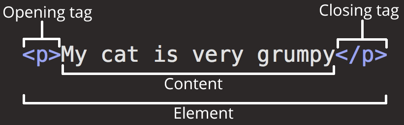
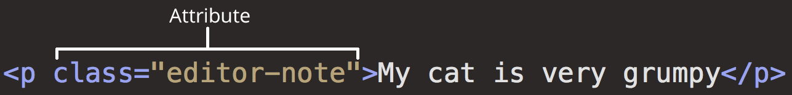

- # What is HTML?
  id:: 61f4c479-b339-4955-a020-f69f285dc047
	- HTML (Hypertext Markup Language) is the code that is used to structure a web page and its content. For example, content could be structured within a set of paragraphs, a list of bulleted points, or using images and data tables. As the title suggests, this article will give you a basic understanding of HTML and its functions.
	  超文本标记语言 (英语：Hypertext Markup Language，简称：HTML ) 是一种用来结构化 Web 网页及其内容的标记语言。
	  [[[ref]: HTML basics - Learn web development | MDN]]
	-
- # Anatomy of HTML element
  collapsed:: true
	- {:height 168, :width 499}
		- Opening tag
		- Closing tag
		- Content
		- Element
	- {:height 96, :width 586}
		- Attributes
		- Attributes contain extra information about the element that you don't want to appear in the actual content.
		- An attribute should always have the following:
			- A space between it and the element name (or the previous attribute, if the element already has one or more attributes).
			- The attribute name followed by an equal sign.
			- The attribute value wrapped by opening and closing quotation marks.
- # Anatomy of HTML Document
  collapsed:: true
	- ```
	  <!DOCTYPE html>
	  <html>
	    <head>
	      <meta charset="utf-8">
	      <title>My test page</title>
	    </head>
	    <body>
	      
	    </body>
	  </html>
	  ```
	- `<!DOCTYPE html>` — doctype. It is a required preamble.  However these days, they don't do much and are basically just needed to make sure your document behaves correctly. That's all you need to know for now.
	- `<html></html>` — the `<html>` element. This element wraps all the content on the entire page and is sometimes known as the root element.
	- `<head></head> `— the `<head>` element. This element acts as a container for all the stuff you want to include on the HTML page that isn't the content you are showing to your page's viewers. This includes things like keywords and a page description that you want to appear in search results, CSS to style our content, character set declarations, and more.
	- `<meta charset="utf-8">`— This element sets the character set your document should use to UTF-8 which includes most characters from the vast majority of written languages. Essentially, it can now handle any textual content you might put on it. There is no reason not to set this and it can help avoid some problems later on.
	- `<title></title>` — the `<title>` element. This sets the title of your page, which is the title that appears in the browser tab the page is loaded in. It is also used to describe the page when you bookmark/favorite it.
	- `<body></body>` — the `<body>` element. This contains all the content that you want to show to web users when they visit your page, whether that's text, images, videos, games, playable audio tracks, or whatever else.
- # Types of HTML element
  collapsed:: true
	- ## Block Element
	  id:: 62009682-56ec-4bbd-b6d0-50f42cb26ff1
	- ## Inline Element
	  id:: 6200968c-cdb2-4b27-9911-6745851abc6d
- # HTML Semantics
  id:: 620cc330-e56a-426a-8e08-e0d4b8c467d8
	- 每一个标签的使用符合其用途和意义
	- 在恰当的需求下使用恰当的HTML元素是一个不错的主意。
	- Refer：
		- 1. http://owenyang0.github.io/maintainablecss-cn/chapters/semantics/
		   2. https://developer.mozilla.org/zh-CN/docs/Glossary/Semantics 
		   3. https://www.zhihu.com/question/20455165
- # [[HTML Tags]]
  id:: 620cc4d8-4dc2-418f-a709-08082b867326
- # HTML Table
	- [[HTML Table]]
- # HTML Form 表单
	-