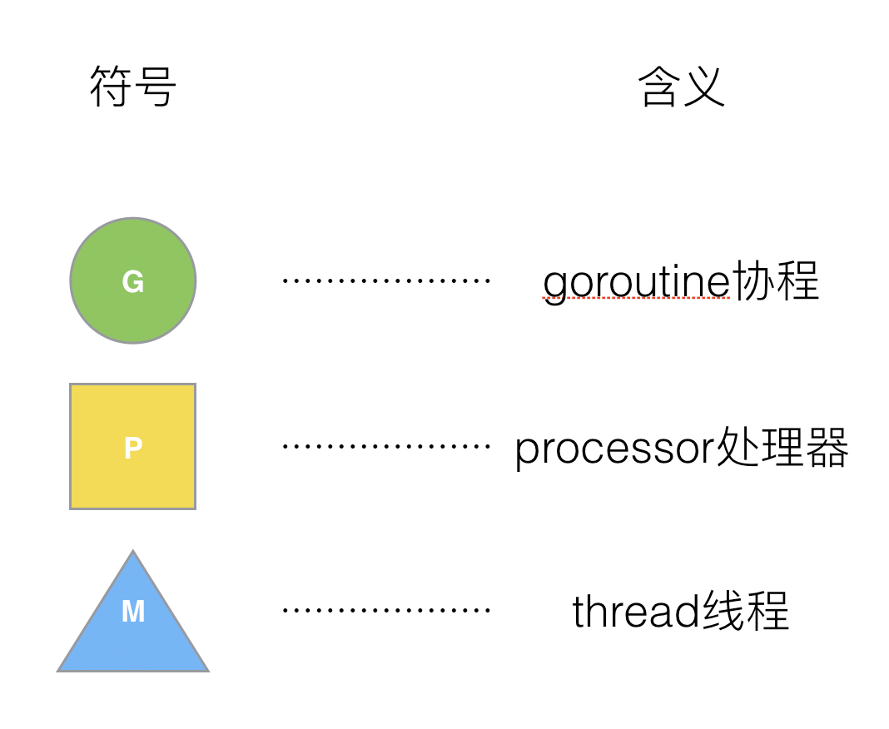
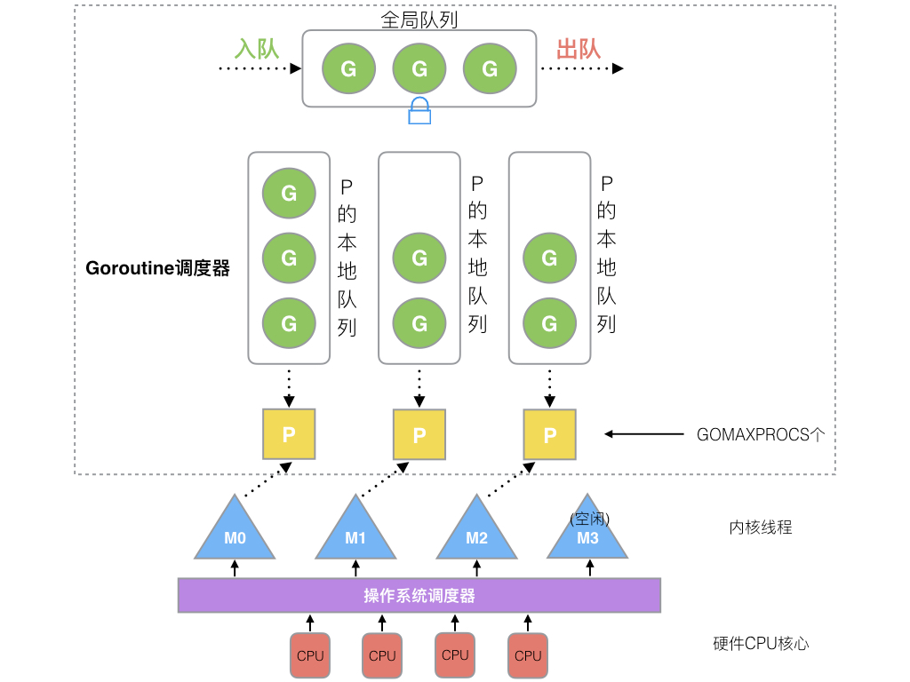

- # 并发
	- ## 协程
		- 1. 协程占用内存小，切换快.调度更灵活(runtime调度)
		  2. 协程 : 线程 = n : m
		- ## GPM 调度
			- 
				- **Processor，它包含了运行goroutine的资源**，如果线程想运行goroutine，必须先获取P，P中还包含了可运行的G队列。
			- 在Go中，**线程是运行goroutine的实体，调度器的功能是把可运行的goroutine分配到工作线程上**。
			- 
				- 1. **全局队列**（Global Queue）：存放等待运行的G。
				  2. **P的本地队列**：同全局队列类似，存放的也是等待运行的G，存的数量有限，不超过256个。新建G’时，G’优先加入到P的本地队列，如果队列满了，则会把本地队列中一半的G移动到全局队列。
				  3. **P列表**：所有的P都在程序启动时创建，并保存在数组中，最多有`GOMAXPROCS`(可配置)个。
				  4. **M**：线程想运行任务就得获取P，从P的本地队列获取G，P队列为空时，M也会尝试从全局队列**拿**一批G放到P的本地队列，或从其他P的本地队列**偷**一半放到自己P的本地队列。M运行G，G执行之后，M会从P获取下一个G，不断重复下去。
		- #
- # `make` & `new`
	- 引用型变量初始化才可以进行操作
	- 相同
		- 堆空间分配
	- 不同
		- make: 只用于slice、map以及channel的初始化， 无可替代
			- 我们在使用slice、map以及channel的时候，还是要使用make进行初始化，然后才才可以对他们进行操作。
		- new: 用于类型内存分配(初始化值为0)， 不常用
- # GC
	- ## 三色标记法
		-
- # nil
	- nil 可以用作 interface、function、pointer、map、slice 和 channel 的“空值”。
	  id:: 6239e215-6c00-4048-aecd-b43f9bbc8f02
- #  map 遍历是随机的